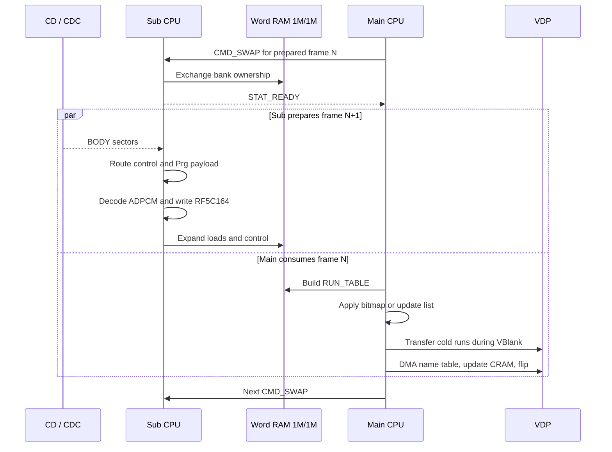
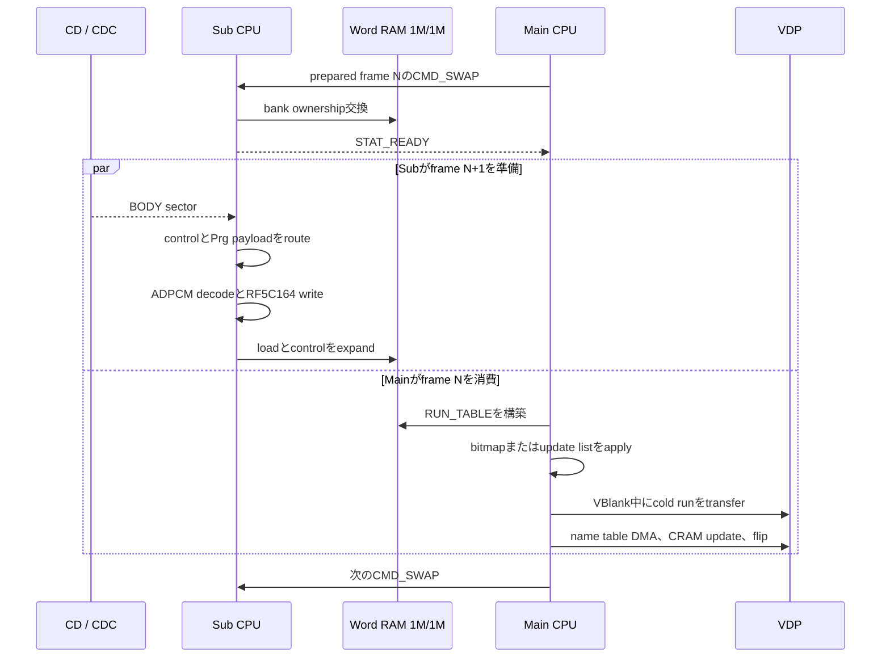

EN / [JP](#jp)

# Player Memory and CPU Headroom

This document answers one planning question: **what memory and CPU time can a
live-playback feature use without consuming an existing safety margin?**

The conservative answer is:

| Domain | Unconditional fixed space | Conditional space |
|---|---:|---:|
| Sub PRG-RAM | 1.313 KiB | 0 bytes in the 4 KiB resident Sub base image |
| each physical Word-RAM bank | 0 B | sector-rounding guard below the fixed tail; not allocatable |
| Main RAM | 2.627 KiB | generated-code and RUN_TABLE tails only with profile-specific assertions |
| Main CPU | 0 guaranteed cycles | measured profile evidence is not a reusable allowance |
| Sub CPU | 0 guaranteed cycles | measured decode time excludes variable BIOS, CD, bus, and bank waits |

“Unconditional” means that the range survives frame 0, movie replay, the
largest supported control block, the physical run-table limit, and both
Word-RAM bank parities. The packed Word-RAM map assigns all remaining complete
sectors to WordBuf, so it exposes no general-purpose free range.

## Safety Rules

- Do not count PrgBuf jitter, overflow, APPLY back-pressure, stack, or
  generated-code guards as free memory.
- Do not add Main and Sub arithmetic remainders together. They execute
  concurrently and synchronize at the Word-RAM handoff.
- BIOS calls, CDC readiness, VBlank phase, DMA completion, shared-memory
  access, and bank settling have no finite instruction-only bound.
- Treat a successful recording as evidence for that exact stream and build,
  not as a general CPU budget.
- Give every new allocation a named address range and a build-time overlap
  assertion.

## Sub PRG-RAM Map

PRG-RAM is 512 KiB at `0x00000..0x7FFFF`.

The address split below uses 30 fps as the primary example. The physical ring,
back-pressure, and overflow guard stay fixed, while the normal PrgBuf and
scheduled Supply ceiling follow the content cadence:

```text
normal PrgBuf KiB = 418 - cadence reserve KiB
cadence reserve KiB = ceil(20 * 30 / fps)
```

These values come from `cadence_jitter_reserve_kb()`, `prg_buf_cap_kb()`, and
`scheduled_delivery_cap_kb()` in `tools/av_config.py`; this document does not
define an independent capacity. The exact schedule stops at the normal ceiling:
378 KiB at 15 fps, 393 KiB at 24 fps, and 398 KiB at 30 fps. The remaining
40/25/20 KiB up to the 418 KiB observation boundary is reserved for live
sector-arrival variation and is not encoder Supply.

| Address | Size | Owner | New feature use |
|---|---:|---|---|
| `0x00000..0x05FFF` | 24.00 KiB | BIOS / low PRG work area | No |
| `0x06000..0x06FFF` | 4.00 KiB | resident specialized Sub base image | No |
| `0x07000..0x07FFF` | 4.00 KiB | boot ISO scratch and BIOS-unsafe streaming range | No |
| `0x08000..0x085FF` | 1.50 KiB | live decoded ADPCM buffer | No |
| `0x08600..0x097FF` | **4.50 KiB** | unassigned marker-verified scratch range; not persistent across startup reads | **Yes, for rewritten scratch only** |
| `0x09800..0x0BFFF` | 10.00 KiB | BIOS-touched during continuous reads | No |
| `0x0C000..0x0CB1F` | 2.781 KiB | persistent ADPCM next-index table | No |
| `0x0CB20..0x0CC1F` | 256 B | persistent ADPCM output lookup table | No |
| `0x0CC20..0x0CC63` | 68 B | persistent position-independent DEBUG helper and its two state words | No |
| `0x0CC64..0x0CFFF` | **924 B** | unused tail of the reserved hot-table page | **Yes, after an overlap check** |
| `0x0D000..0x707FF` | 398.00 KiB | normal PrgBuf capacity at 30 fps | No |
| `0x70800..0x757FF` | 20.00 KiB | delivery-jitter headroom at 30 fps | No |
| `0x75800..0x75FFF` | 2.00 KiB | observation guard before pump back-pressure | No |
| `0x76000..0x76FFF` | 4.00 KiB | physical PrgBuf overflow guard; `0x76800..0x76857` executes the qualified ADPCM entry, and longer-route builds may use through `0x76943` | No |
| `0x77000..0x7F7FF` | 34.00 KiB | APPLY circular queue | No |
| `0x7F800..0x7FEFF` | 1.75 KiB | Sub stack reserve | No |
| `0x7FF00..0x7FFFF` | 256 B | area above the configured stack top | No |

The BIOS boot source remains at disc offset `0x07000` and contains only the
4 KiB resident Sub module loaded at PRG `0x06000`. The packer places the exact
324-byte hash-bound extension after the 8,800-byte ADPCM table in its existing
five-sector padding. Sub stages that image at `0x7B000`, copies the extension
from `0x7D260` in two ways: its qualified first 88 bytes run from the unused
timed-ring tail at `0x76800`; when routing is at most 8 KiB, the second entry
runs in place at `0x7D2B8` after prebuffer, while longer-route builds copy the
complete extension first. These boot-only entries install ADPCM tables,
prepare routing and the initial ring/APPLY/frame state, and copy a 68-byte
position-independent DEBUG helper to `0x0CC20..0x0CC63`. Timed code calls that
helper only for the combined H40 HUD. Frame-0 staging may then overwrite both
temporary extension locations. The persistent hot-table page and DEBUG helper
remain immediately before PrgBuf.

The physical PrgBuf ring is 424 KiB. At 30 fps its normal and scheduled cap is
below the 418 KiB observation boundary by a 20 KiB cadence reserve. At 15 fps
the normal and scheduled cap is 378 KiB, leaving 40 KiB for live jitter. Pump
back-pressure begins at 420 KiB, and the remaining 4 KiB is a separate
overflow guard. None of these differences is feature memory.

During boot only, frame-0 pattern staging uses
`0x72000..0x7AFFF`. It may overlap the timed ring tail and APPLY because those
owners are inactive in that phase; it does not change the timed 30 fps map.

The APPLY queue also retains deliberate back-pressure headroom. Its unused
instantaneous occupancy is not a fixed allocation.

## Word RAM 1M/1M Map

There are two independent 128 KiB physical banks. Sub owns one bank while Main
owns the other. A bank swap exchanges ownership; it does not make one copy
simultaneously visible to both CPUs.

`tools/pattern_supply.py` derives the map from frame count, cell count, and cold
cap. Routing occupies `ceil(frames / 2048) * 2048` bytes at the bank end. The
fixed tail is packed immediately below routing:

| Relative order, high to low | Size | Owner |
|---|---:|---|
| bank end | variable, sector-rounded | resident routing table |
| below routing | 1,536 B | unallocated A/B-stable guard; not feature memory |
| next | 8,800 B | A/B-stable ADPCM reservation; only the 5,696-byte signed-delta portion is populated |
| next | 2,048 B | CD-sector stage / pad discard |
| next | 8,192 B | linear control scratch |
| next | 256 B | DEBUG counters and copied header |

The front of each bank starts with `O_PALW` and `O_NLOAD` (four bytes total),
followed by `O_LOADS`. Main reads name updates directly from the control
scratch; `O_CRAM`, `O_NUPD`, and `O_UPDS` do not exist.

WordBuf starts after the parity-specific `O_LOADS` envelope and ends before the
fixed tail. Wr0 reserves one frame-0 run containing every encoded cell. Wr1
reserves 32 pattern bytes plus one four-byte descriptor for every allowed timed
cold pattern. Each capacity is rounded down to complete 2 KiB preload sectors,
so disc-sector padding cannot overwrite the fixed tail.

For a 6,576-frame, 40x28-cell, cold-180 example:

| Bank item | Wr0 / frame-0 bank | Wr1 / timed-only bank |
|---|---:|---:|
| `O_LOADS` envelope | 35,844 B | 6,480 B |
| WordBuf range | `+0x08C20..+0x18C1F` | `+0x01960..+0x1895F` |
| WordBuf capacity | 2,048 patterns | 2,944 patterns |
| sector-rounding guard below status | 640 B | 1,344 B |

Routing is 8 KiB in this example and starts at `+0x1E000`. The combined
WordBuf capacity is 4,992 patterns. The two regions contain different
parity-selected streams.

During boot, BOOT_STAGE uses `+0x0000..+0x5FFF` with PALTAB at `+0x1000`;
DicBuf staging uses `+0x6000..+0x7FFF`. Sub gives that bank to Main, Main copies
the palette, dictionary, and optional VRAM sidecar to their persistent homes,
and Main returns the bank. Sub stops `HEADER.DAT` before this handoff and
restarts at the exact first unread sector after the return, so the copy
interval cannot create a sector slip. Frame 0 and WordBuf may then overwrite
the staging range safely. Dump diagnostics write list-form updates into
control scratch.

## Main RAM Map

Main RAM is `0xFF0000..0xFFFFFF`. Generated code grows upward and is build-time
checked against the persistent DicBuf boundary.

| Address | Size | Owner | Fixed headroom |
|---|---:|---|---:|
| `0xFF0000..0xFF65FF` | 25.50 KiB | permanent player, transient boot UI, generated handlers and guard | 0 without build-specific proof |
| `0xFF6600..0xFF85FF` | 8.00 KiB | persistent DicBuf | 0 |
| `0xFF8600..0xFFAFFF` | 10.50 KiB | 488-entry pre-swizzled RUN_TABLE | 0 |
| `0xFFB000..0xFFCFFF` | 8.00 KiB | 64-entry PALTAB | 0 |
| `0xFFD000..0xFFF07D` | 8,318 B | BSS, shadow, DEBUG HUD row, name-table stage, state | 0 |
| `0xFFF07E..0xFFFAFF` | **2.627 KiB** | unused below stack guard | **2.627 KiB** |
| `0xFFFB00..0xFFFCFF` | 512 B | stack and interrupt reserve | 0 |
| `0xFFFD00..0xFFFFFF` | 768 B | area above stack top / BIOS reserve | 0 |

RUN_TABLE space beyond a profile's realized maximum and any gap below
generated code are conditional. They may be used only with symbols and
assertions that preserve the supported cold cap and maximum generated output.

## Per-Frame CPU Sequence

After a bank swap, Main consumes frame `N` while Sub prepares frame `N+1`.



Sub wait loops service a pending `CMD_SWAP` before another opportunistic sector
pump. CD pumping continues while Main is genuinely idle, but future payload
work cannot delay an already-pending handoff.

The Main and Sub stopwatches cover selected phases, not the complete deadline.
DMA, RF5C164 writes, BIOS calls, CDC polls, bank settling, and shared-memory
waits keep the unconditional spendable CPU remainder at zero.

## Allocation Order

Use low-risk space in this order:

1. Use Main RAM `0xFFF07E..0xFFFAFF` for Main-only state and keep the stack
   guard.
2. Use generated-code or RUN_TABLE tails only with profile-specific end
   symbols and bounds.
3. Use PRG `0x08600..0x097FF` only for scratch that is rewritten after startup,
   or the checked `0x0CC64..0x0CFFF` hot-table tail for persistent data, and
   only after adding the allocation to `tools/check_player_ring.py`.

Never allocate from payload jitter, PrgBuf overflow, APPLY back-pressure,
stack, VBlank, DMA safety reserves, or WordBuf sector-rounding guards.

## CPU Qualification

A sustained new path needs:

- a Sub stopwatch around its work;
- a pack-time Main guard for its worst run or transfer cost;
- full-length recordings for every supported cadence and display mode it
  affects;
- HUD gates with no stream slip, desync, recovery, or unplanned cadence wait;
- stable audio lead and exact decoded frame counts; and
- cycle and memory assertions in the same change as the allocation.

## Reproducing the Audit

Use the managed Python environment and an explicit profile:

```sh
tools/python.sh tools/check_player_ring.py \
  --constants out/PROFILE/player_constants.inc \
  --extension tmp/PROFILE/build/movieplay_sp_ext.bin \
  --extension-constants tmp/PROFILE/build/sp_extension.inc
make movieplay CONFIG=configs/PROFILE.toml \
  DEBUG=1 MAIN_CODEGEN=1 DMA_RUN_FASTPATH=1 PLAYER_SPECIALIZE=1

~/toolchains/mars/m68k-elf/bin/m68k-elf-size -A \
  tmp/PROFILE/build/movieplay_ip.o \
  tmp/PROFILE/build/movieplay_sp.o
```

Rebuild, pack with verification, and complete the DEBUG recording and HUD gate
before revising any elapsed-time or memory-headroom claim.

---

<a id="jp"></a>

# Player memoryとCPU余裕

この文書は、**既存の安全余裕を消費せずにlive-playback featureが使えるmemoryとCPU
時間はどれだけか**、というplanning上の問いに答えます。

保守的な回答は次のとおりです。

| Domain | 無条件に固定利用できる領域 | 条件付き領域 |
|---|---:|---:|
| Sub PRG-RAM | 1.313 KiB | 4 KiB resident Sub base image内の余り0 byte |
| 各physical Word-RAM bank | 0 B | fixed tail直下のsector丸めguard。割り当て不可 |
| Main RAM | 2.627 KiB | generated-codeとRUN_TABLEのtailはprofile固有assert付きのみ |
| Main CPU | 保証cycle 0 | Profile実測は再利用可能なallowanceではない |
| Sub CPU | 保証cycle 0 | Decode実測は可変のBIOS、CD、bus、bank waitを含まない |

「無条件」とは、frame 0、movie replay、最大対応control block、物理run-table上限、
両方のWord-RAM bank parityを通して使えることです。Packed Word-RAM mapは残る完全な
sectorをすべてWordBufへ割り当てるため、汎用free rangeはありません。

## 安全規則

- PrgBuf jitter、overflow、APPLY back-pressure、stack、generated-code guardを
  free memoryとして数えません。
- MainとSubの算術上の余りを合算しません。両者は並列実行し、Word-RAM handoffで同期します。
- BIOS call、CDC readiness、VBlank phase、DMA completion、shared-memory access、
  bank settleには有限のinstruction-only boundがありません。
- 成功したrecordingはそのstreamとbuildの証拠であり、一般的なCPU予算ではありません。
- 新allocationには名前付きaddress rangeとbuild-time overlap assertionを付けます。

## Sub PRG-RAM map

PRG-RAMは`0x00000..0x7FFFF`の512 KiBです。

次のaddress分割は30 fpsを主例にしています。Physical ring、back-pressure、
overflow guardは固定ですが、normal PrgBufとscheduled Supply上限は
content cadenceに応じて動きます。

```text
normal PrgBuf KiB = 418 - cadence reserve KiB
cadence reserve KiB = ceil(20 * 30 / fps)
```

数値は `tools/av_config.py` の `cadence_jitter_reserve_kb()`、
`prg_buf_cap_kb()`、`scheduled_delivery_cap_kb()` から得ます。この文書では独立した
容量を定義しません。正確なscheduleは通常上限、つまり15 fpsで378 KiB、24 fpsで
393 KiB、30 fpsで398 KiBに止めます。418 KiB観測境界までの40/25/20 KiBはliveの
sector到着変動専用で、encoder Supplyではありません。

| Address | Size | Owner | New featureでの利用 |
|---|---:|---|---|
| `0x00000..0x05FFF` | 24.00 KiB | BIOS / low PRG work area | 不可 |
| `0x06000..0x06FFF` | 4.00 KiB | resident specialized Sub base image | 不可 |
| `0x07000..0x07FFF` | 4.00 KiB | boot ISO scratchとBIOS-unsafe streaming range | 不可 |
| `0x08000..0x085FF` | 1.50 KiB | live decoded ADPCM buffer | 不可 |
| `0x08600..0x097FF` | **4.50 KiB** | 未割当のmarker検証済みscratch range。startup readを越える永続保持は不可 | **毎回書き直すscratchのみ利用可** |
| `0x09800..0x0BFFF` | 10.00 KiB | continuous read中にBIOSが使用 | 不可 |
| `0x0C000..0x0CB1F` | 2.781 KiB | persistent ADPCM next-index table | 不可 |
| `0x0CB20..0x0CC1F` | 256 B | persistent ADPCM output lookup table | 不可 |
| `0x0CC20..0x0CC63` | 68 B | persistentなposition-independent DEBUG helperと2つのstate word | 不可 |
| `0x0CC64..0x0CFFF` | **924 B** | hot-table予約pageの未使用tail | **overlap check追加後に利用可** |
| `0x0D000..0x707FF` | 398.00 KiB | 30 fpsのnormal PrgBuf capacity | 不可 |
| `0x70800..0x757FF` | 20.00 KiB | 30 fpsのdelivery-jitter headroom | 不可 |
| `0x75800..0x75FFF` | 2.00 KiB | pump back-pressure前の観測guard | 不可 |
| `0x76000..0x76FFF` | 4.00 KiB | physical PrgBuf overflow guard。`0x76800..0x76857`でqualified済みADPCM入口を実行し、長いroutingのbuildは`0x76943`まで使用可能 | 不可 |
| `0x77000..0x7F7FF` | 34.00 KiB | APPLY circular queue | 不可 |
| `0x7F800..0x7FEFF` | 1.75 KiB | Sub stack reserve | 不可 |
| `0x7FF00..0x7FFFF` | 256 B | configured stack topより上 | 不可 |

BIOS boot sourceはdisc offset `0x07000`のままで、PRG `0x06000`へloadする4 KiB
resident Sub moduleだけを持ちます。Packerはhashで固定した324-byte extensionを
8,800-byte ADPCM table直後の既存5-sector paddingへ配置します。Subはそのimageを
`0x7B000`へstageします。Qualified済み先頭88 byteは未使用timed-ring tailの
`0x76800`で実行します。routingが8 KiB以下なら第2入口をprebuffer後に`0x7D2B8`で
そのまま実行し、長いroutingのbuildはextension全体を先にcopyします。これらの
boot-only入口がADPCM install、routing prepare、初期ring/APPLY/frame state設定を行い、
68-byteのposition-independent DEBUG helperを`0x0CC20..0x0CC63`へcopyします。
Timed codeがこのhelperをcallするのはcombined H40 HUDだけです。その後はframe-0
stagingが両temporary extension locationを上書きできます。Persistent hot-table pageと
DEBUG helperはPrgBuf直前に残ります。

Physical PrgBuf ringは424 KiBです。30 fpsではnormal・scheduled capが20 KiBのcadence
reserve分だけ418 KiB観測境界より小さくなります。15 fpsのnormal・scheduled capは
378 KiBで、live jitter用に40 KiBを残します。Pump back-pressureは420 KiBで始まり、
残る4 KiBは別のoverflow guardです。これらの差分はfeature memoryではありません。

boot中だけ、frame-0 pattern stagingは `0x72000..0x7AFFF` を使います。そのphaseでは
timed ring tailとAPPLYのownerがinactiveなので重複できます。timed 30 fps mapは
変わりません。

APPLY queueにも意図的なback-pressure headroomがあります。瞬間的な未使用occupancyは
固定allocationではありません。

## Word RAM 1M/1M map

128 KiBの独立したphysical bankが2つあります。Subが一方を所有するときMainは他方を
所有します。Bank swapはownershipを交換するだけで、同じcopyを両CPUへ同時公開しません。

`tools/pattern_supply.py` がframe数、cell数、cold capからmapを導出します。Routingは
bank末尾に `ceil(frames / 2048) * 2048` byteを使います。Fixed tailはroutingの直下へ
次の順で詰めます。

| 上から下への相対順 | Size | Owner |
|---|---:|---|
| bank末尾 | 可変、sector丸め | resident routing table |
| routing直下 | 1,536 B | 未割当のA/B-stable guard。feature memoryではない |
| 次 | 8,800 B | A/B-stable ADPCM予約。実際に配置するのは5,696-byte signed-delta部分だけ |
| 次 | 2,048 B | CD-sector stage / pad discard |
| 次 | 8,192 B | linear control scratch |
| 次 | 256 B | DEBUG counterとcopied header |

各bankの先頭は `O_PALW` と `O_NLOAD`（合計4 byte）、続いて `O_LOADS` です。Mainは
name updateをcontrol scratchから直接読むため、`O_CRAM`、`O_NUPD`、`O_UPDS` は
存在しません。

WordBufはparity別 `O_LOADS` envelopeの直後からfixed tailの手前までです。Wr0は全encoded
cellを含むframe-0の1 runを予約します。Wr1はtimed cold上限の各patternにつき32 pattern
byteと4 byte descriptorを予約します。容量は完全な2 KiB preload sectorへ切り下げるため、
disk sectorのpadはfixed tailを上書きしません。

6,576 frame、40x28 cell、cold 180の例は次のとおりです。

| Bank item | Wr0 / frame-0 bank | Wr1 / timed-only bank |
|---|---:|---:|
| `O_LOADS` envelope | 35,844 B | 6,480 B |
| WordBuf range | `+0x08C20..+0x18C1F` | `+0x01960..+0x1895F` |
| WordBuf capacity | 2,048 patterns | 2,944 patterns |
| status直下のsector丸めguard | 640 B | 1,344 B |

この例のroutingは8 KiBで、`+0x1E000`から始まります。WordBuf合計容量は4,992
patternsです。2つのregionにはparity別の異なるstreamが入ります。

Boot中はBOOT_STAGEが `+0x0000..+0x5FFF`、その中のPALTABが `+0x1000`、DicBuf stageが
`+0x6000..+0x7FFF` を使います。SubがそのbankをMainへ渡し、Mainはpalette、dictionary、
任意のVRAM sidecarをpersistentな保存先へcopyしてbankを返します。Subはhandoff前に
`HEADER.DAT` を停止し、返却後に正確な最初の未読sectorから再開するため、copy intervalが
sector slipを発生させません。その後はframe 0とWordBufがstage rangeを安全に上書き
できます。Dump diagnosticはlist形式のupdateをcontrol scratchへ書きます。

## Main RAM map

Main RAMは`0xFF0000..0xFFFFFF`です。Generated codeは上方向へ伸び、persistent DicBuf
boundaryに対してbuild-time checkされます。

| Address | Size | Owner | 固定headroom |
|---|---:|---|---:|
| `0xFF0000..0xFF65FF` | 25.50 KiB | permanent player、transient boot UI、generated handler、guard | build固有proofなしでは0 |
| `0xFF6600..0xFF85FF` | 8.00 KiB | persistent DicBuf | 0 |
| `0xFF8600..0xFFAFFF` | 10.50 KiB | 488-entry pre-swizzled RUN_TABLE | 0 |
| `0xFFB000..0xFFCFFF` | 8.00 KiB | 64-entry PALTAB | 0 |
| `0xFFD000..0xFFF07D` | 8,318 B | BSS、shadow、DEBUG HUD row、name-table stage、state | 0 |
| `0xFFF07E..0xFFFAFF` | **2.627 KiB** | stack guard下の未使用領域 | **2.627 KiB** |
| `0xFFFB00..0xFFFCFF` | 512 B | stackとinterrupt reserve | 0 |
| `0xFFFD00..0xFFFFFF` | 768 B | stack topより上 / BIOS reserve | 0 |

Profileの実maximumを超えるRUN_TABLE領域やgenerated code下のgapは条件付きです。
対応cold capと最大generated outputを守るsymbolとassertionがある場合だけ使えます。

## FrameごとのCPU sequence

Bank swap後、Mainはframe `N`を消費し、Subは他方のbankでframe `N+1`を準備します。



Sub wait loopは、別のopportunistic sector pumpより先にpending `CMD_SWAP`を処理します。
Mainが本当にidleな間はCD pumpを続けますが、将来payloadの処理がpending handoffを
遅らせることはできません。

MainとSubのstopwatchは選択phaseだけを測り、deadline全体ではありません。DMA、
RF5C164 write、BIOS call、CDC poll、bank settle、shared-memory waitがあるため、
無条件に支出できるCPU余りは0です。

## Allocation順

低risk領域を次の順で使います。

1. Main-only stateにはMain RAM `0xFFF07E..0xFFFAFF`を使い、stack guardを残します。
2. Generated-codeまたはRUN_TABLE tailは、profile固有のend symbolとbound付きでだけ
   使います。
3. PRG `0x08600..0x097FF`はstartup後に書き直すscratchだけに使います。Persistent
   dataには検査済み`0x0CC64..0x0CFFF` hot-table tailを使えます。どちらも
   `tools/check_player_ring.py`へ追加した後に使います。

Payload jitter、PrgBuf overflow、APPLY back-pressure、stack、VBlank、DMAの
safety reserve、WordBufのsector丸めguardからは割り当てません。

## CPU qualification

継続的なnew pathには次が必要です。

- その処理を囲むSub stopwatch
- worst runまたはtransfer costに対するpack-time Main guard
- 影響する全cadenceとdisplay modeのfull-length recording
- stream slip、desync、recovery、予定外cadence waitがないHUD gate
- stable audio leadと正確なdecoded frame count
- allocationと同じ変更に含めるcycle・memory assertion

## Auditの再現

Managed Python環境と明示的なprofileを使います。

```sh
tools/python.sh tools/check_player_ring.py \
  --constants out/PROFILE/player_constants.inc \
  --extension tmp/PROFILE/build/movieplay_sp_ext.bin \
  --extension-constants tmp/PROFILE/build/sp_extension.inc
make movieplay CONFIG=configs/PROFILE.toml \
  DEBUG=1 MAIN_CODEGEN=1 DMA_RUN_FASTPATH=1 PLAYER_SPECIALIZE=1

~/toolchains/mars/m68k-elf/bin/m68k-elf-size -A \
  tmp/PROFILE/build/movieplay_ip.o \
  tmp/PROFILE/build/movieplay_sp.o
```

経過時間やmemory headroomの記述を変更する前に、rebuild、verify付きpack、DEBUG
recording、HUD gateを完了します。
