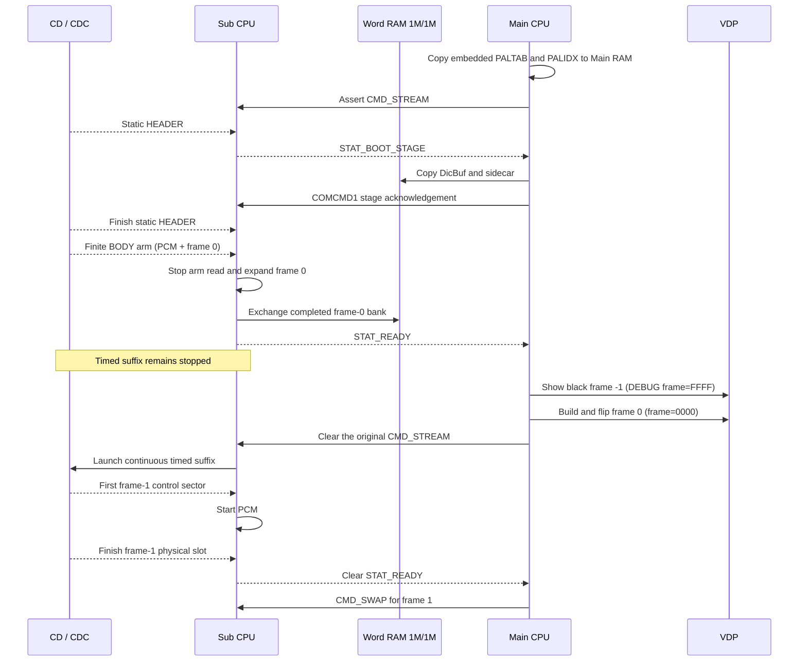
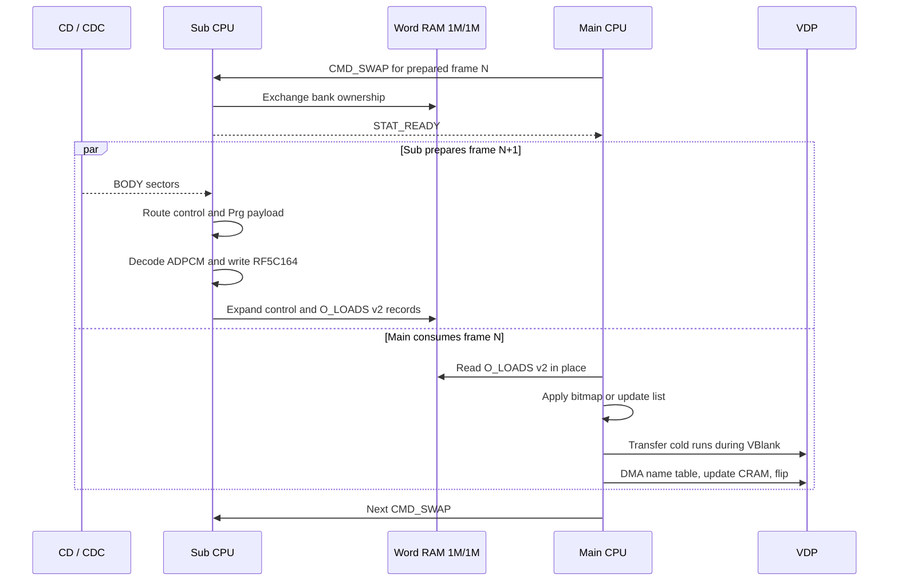
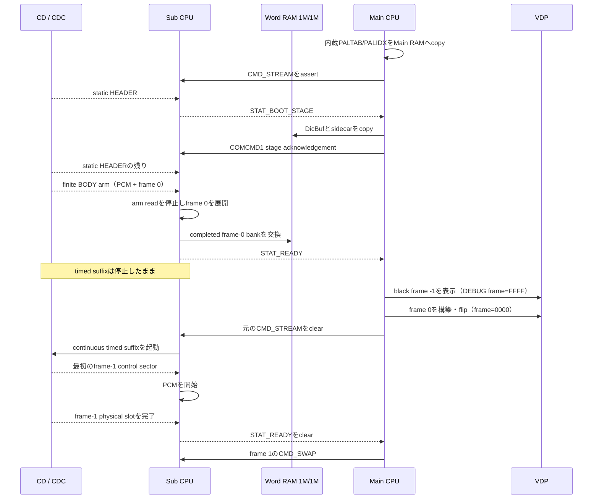
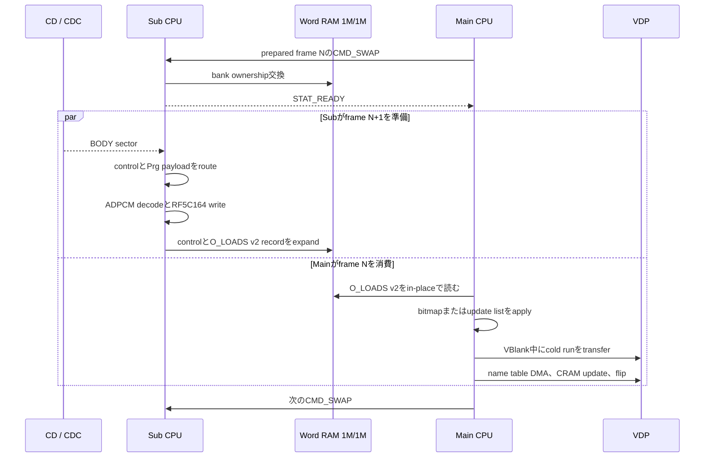

EN / [JP](#jp)

# Player Memory Maps and Runtime Sequence

This document describes the player as currently built: the Sub PRG-RAM,
Word RAM 1M/1M, and Main RAM maps, the startup sequence, and the per-frame
CPU handoff. Each map row carries a short range name (shown as `CODE`) so a
range can be referenced unambiguously in issues, commits, and reviews.

**fps dependence.** Between 15 fps and 30 fps content, the only address-map
difference is the `PRG-BUF` / `JITTER` split inside the fixed
`0x0D800..0x74FFF` region; that split is the one place below where both
values are listed side by side. Every other row of every map, and the whole
startup / per-frame sequence, are identical at 15 fps and 30 fps, so a single
value there applies to both rates. Word-RAM WordBuf and routing sizes vary by
profile (frame count, cell count, cold cap), not by fps.

## Unallocated Space Summary

These are the only ranges with no live owner data. Guards, reserves, and
jitter ranges elsewhere in the maps are allocated to their protective role
and are listed in place.

| Domain | Unallocated ranges |
|---|---|
| Sub PRG-RAM | `SP-GAP` 224 B, `SCRATCH` 256 B, and `RING-ALIGN` 448 B |
| Word RAM (each bank) | none — every complete sector is assigned; `WB-GAP` is a sector-rounding remainder, not an allocatable range |
| Main RAM | `M-FREE` 10.50 KiB; the 192 B cushion below `M-STACK` is a guard, not allocatable |

## Sub PRG-RAM Map

PRG-RAM is 512 KiB at `0x00000..0x7FFFF`.

| Name | Address | Size | Contents |
|---|---|---:|---|
| `BIOS-LOW` | `0x00000..0x05FFF` | 24.00 KiB | BIOS / low PRG work area |
| `SP-RES` | `0x06000..0x073FF` | 5.00 KiB | BIOS-loaded resident specialized SP image; the linker rejects a larger image |
| `ADP-IDX` | `0x07400..0x07F1F` | 2,848 B | persistent ADPCM next-index table, copied once at boot; the full range is continuous-read marker-qualified |
| `SP-GAP` | `0x07F20..0x07FFF` | 224 B | unallocated marker-qualified tail |
| `PCM-BUF` | `0x08000..0x085FF` | 1.50 KiB | live decoded ADPCM buffer |
| `WORD-PENDING0` | `0x08600..0x08DFF` | 2.00 KiB | first Sub-owned sector waiting for its parity WordBuf bank |
| `WORD-PENDING1` | `0x08E00..0x095FF` | 2.00 KiB | second pending WordBuf sector |
| `ADP-OUT` | `0x09600..0x096FF` | 256 B | persistent predictor-high-byte to RF5C164 output lookup |
| `SCRATCH` | `0x09700..0x097FF` | 256 B | unallocated marker-qualified scratch; the SP-tail diagnostic installs its checker here |
| `BIOS-CD` | `0x09800..0x0BFFF` | 10.00 KiB | BIOS-touched during continuous reads |
| `ADP-DELTA` | `0x0C000..0x0D63F` | 5,696 B | persistent signed ADPCM delta table, copied once at boot |
| `RING-ALIGN` | `0x0D640..0x0D7FF` | 448 B | unallocated gap that sector-aligns PrgBuf |
| `PRG-BUF` | fps split, see next table | 374 / 394 KiB | streamed PrgBuf normal ceiling |
| `JITTER` | fps split, see next table | 40 / 20 KiB | live delivery-jitter reserve above the scheduled ceiling |
| `OBS-GUARD` | `0x75000..0x757FF` | 2.00 KiB | observation guard below pump back-pressure |
| `OVF-GUARD` | `0x75800..0x767FF` | 4.00 KiB | physical PrgBuf overflow guard |
| `WORD-PENDING3` | `0x76800..0x76FFF` | 2.00 KiB | third Sub-PRG pending destination (`WORD_PENDING3` in the player); the boot-only extension executes here before timed playback |
| `APPLY` | `0x77000..0x7F7FF` | 34.00 KiB | APPLY circular queue |
| `SUB-STACK` | `0x7F800..0x7FEFF` | 1.75 KiB | Sub stack reserve |
| `STACK-TOP` | `0x7FF00..0x7FFFF` | 256 B | area above the configured stack top |

### `PRG-BUF` / `JITTER` fps split

The physical bounds are fixed at every fps: the PrgBuf ring is 420 KiB at
`0x0D800..0x767FF`, pump back-pressure begins at 416 KiB, and the delivery
observation boundary is 414 KiB (`..0x74FFF`). Inside that fixed region the
normal/scheduled ceiling and the jitter reserve move with content cadence:

```text
normal PrgBuf KiB = 414 - cadence reserve KiB
cadence reserve KiB = ceil(20 * 30 / fps)
```

| Item | 15 fps | 30 fps |
|---|---|---|
| cadence reserve | 40 KiB | 20 KiB |
| `PRG-BUF` normal / scheduled ceiling | 374 KiB | 394 KiB |
| `PRG-BUF` address | `0x0D800..0x6AFFF` | `0x0D800..0x6FFFF` |
| `JITTER` address | `0x6B000..0x74FFF` | `0x70000..0x74FFF` |

Other rates follow the same formula (24 fps: reserve 25 KiB, ceiling 389 KiB,
`PRG-BUF` = `0x0D800..0x6EBFF`). The values come from
`cadence_jitter_reserve_kb()`, `prg_buf_cap_kb()`, and
`scheduled_delivery_cap_kb()` in `tools/av_config.py`; this document defines
no independent capacity. The `JITTER` reserve is kept for live sector-arrival
variation and is never encoder Supply.

### `SP-RES` usage

The 32 KiB disc system area places the SP source at offset `0x06000` and
reserves its final 5 KiB. The BIOS loads the exact linked image contiguously
at Sub PRG `0x06000`; it is not limited to one 4 KiB sector pair. The image
is profile-specialized (`PLAYER_SPECIALIZE`) and the linker enforces the hard
end at `0x07400`. Continuous-read marker qualification covers the reclaimed
`0x07400..0x07FFF` interval before `ADP-IDX` uses its leading 2,848 bytes.

The packer places the exact 940-byte hash-bound extension after the
8,800-byte ADPCM table in its existing five-sector padding. Sub stages that
image at `SP-STAGE` (`0x7B000`) and runs the extension from `0x7D260` in two
ways: its qualified first 88 bytes run from `EXT-RUN` (`0x76800`, the unused
timed-ring tail); when routing is at most 8 KiB, the second entry runs in
place at `0x7D2B8` after prebuffer, while longer-route builds copy the
complete extension first. The extension also initializes wave RAM from its
fixed `+0x300` entry at staged address `0x7D560`. These boot-only entries copy
all three ADPCM tables once to their Sub PRG destinations, prepare routing,
and initialize PCM plus the ring/APPLY/frame state. Frame-0 staging may then
overwrite both temporary extension locations.

### Boot-only overlays

| Name | Address | Phase |
|---|---|---|
| `ISO-SCR` | `0x67000..0x76FFF` | 64 KiB scratch image during ISO discovery only |
| `F0-STAGE` | `0x72000..0x7AFFF` | frame-0 pattern staging |
| `SP-STAGE` | `0x7B000..` | staged SP image containing the extension source |
| `EXT-RUN` | `0x76800..0x76BAB` | boot-only extension execution window; timed playback reuses its first sector as `WORD-PENDING3` |

`ISO-SCR` and `F0-STAGE` may overlap the timed ring tail, and `F0-STAGE` may
also overlap `APPLY`, because those timed owners are inactive in each boot
phase. Neither overlay changes the timed map.

The APPLY queue retains deliberate back-pressure headroom; its unused
instantaneous occupancy is not a fixed allocation.

## Word RAM 1M/1M Map

There are two independent 128 KiB physical banks. Sub owns one bank while
Main owns the other. A bank swap exchanges ownership; it does not make one
copy simultaneously visible to both CPUs. This map varies by profile, not by
fps.

`tools/pattern_supply.py` derives the map from frame count, the final
source-grouped run plan, and cold cap. Routing occupies
`ceil(frames / 2048) * 2048` bytes at the bank end. The fixed tail is packed
immediately below routing:

| Name | Relative order, high to low | Size | Contents |
|---|---|---:|---|
| `ROUTE` | bank end | variable, sector-rounded | resident routing table |
| `SECT-STG` | next | 2,048 B | CD-sector stage / pad discard |
| `CTRL-SCR` | next | 8,192 B | linear control scratch |
| `DBG-HDR` | next | 256 B | DEBUG counters and copied header |

The front of each bank starts with `W-HDR`: `O_NRUN` and `O_NLOAD`, two bytes
each. `LOADS` (`O_LOADS`) follows at `+0x0004`. Main reads name updates
directly from `CTRL-SCR`; `O_CRAM`, `O_NUPD`, and `O_UPDS` do not exist.

Sub expands each on-disc four-byte source run into one 22-byte `O_LOADS v2`
record containing VDP-ready DMA length, registers, destination command, and
resolved source. Only Prg records carry their 32-byte-per-pattern payload
inline immediately after the record. Wr and Dic records point at their
persistent stores. Main reads this one cursor in place; it does not build or
copy a run table. The encoder splits a Wr descriptor at its parity WordBuf
ring end before packing. Sub therefore emits only linear source spans, and
Main can run each Word-RAM DMA without wrapping a source address.

| Record offset | Size | Value |
|---:|---:|---|
| `+0` | 2 B | DMA length in words (`patterns * 16`) |
| `+2`, `+4` | 2 B each | prebuilt VDP registers 93 and 94 |
| `+6` | 4 B | destination VDP command without the DMA trigger bit |
| `+10` | 2 B | raw destination byte address for split-run continuation |
| `+12`, `+14`, `+16` | 2 B each | prebuilt VDP source registers 95, 96, and 97 |
| `+18` | 4 B | raw Main-view source address; for Prg it equals the following inline-payload cursor |

`WORDBUF` starts after the parity-specific exact `LOADS` peak and ends before
the fixed tail. The encoder recomputes the even and odd maxima over every
frame as `32 * inline Prg patterns + 22 * runs`, writes both byte counts to
PSUP, and freezes the resulting starts in `player_constants.inc`. Only the
residual after that first reservation becomes WordBuf capacity, rounded down
to complete 2 KiB preload sectors. The two banks can therefore have different
starts and capacities; `WB-GAP` is the remaining sub-sector rounding space.

During boot, `BOOT-STG` uses `+0x0000..+0x5FFF` for the optional boot-VRAM
sidecar records; `DIC-STG` uses `+0x6000..+0x9FFF` for DicBuf staging. The
palette table and switch table are not staged here: the Main-IP image embeds
`paltab.bin` / `palidx.bin` and copies both to `M-PALTAB` / `M-PALIDX` at
entry, before generated code reuses the transient `.startup` area. Sub
gives the staging bank to Main, Main copies the dictionary and optional VRAM
sidecar to their persistent homes, and Main returns the bank. Sub stops `HEADER.DAT` before
this handoff and restarts at the exact first unread sector after the return,
so the copy interval cannot create a sector slip. Sub then reads the finite
untimed BODY arm and expands frame 0; frame 0 and `WORDBUF` may overwrite the
temporary staging range safely. Dump diagnostics write list-form updates into
`CTRL-SCR`.

## Main RAM Map

Main RAM is `0xFF0000..0xFFFFFF`. This map is completely fixed: it is
identical in every build, profile, and fps. Generated code grows upward and is
build-time checked against the `M-STATE` base.

| Name | Address | Size | Contents |
|---|---|---:|---|
| `M-CODE` | `0xFF0000..0xFF66FF` | 25.75 KiB | permanent player, transient boot UI, generated handlers and guard |
| `M-STATE` | `0xFF6700..0xFF87FF` | 8.25 KiB | BSS, shadow, DEBUG HUD row, name-table stage, state; worst-case fixed reserve |
| `M-FREE` | `0xFF8800..0xFFB1FF` | 10.50 KiB | unallocated space released by in-place `O_LOADS v2` consumption |
| `M-PALTAB` | `0xFFB200..0xFFB9FF` | 2.00 KiB | 16-entry PALTAB (player-embedded paltab.bin) |
| `M-PALIDX` | `0xFFBA00..0xFFBA3F` | 64 B | 16-entry palette-switch table, 15 switches + sentinel (player-embedded palidx.bin) |
| `M-DIC` | `0xFFBA40..0xFFFA3F` | 16.00 KiB | 512-pattern persistent DicBuf |
| guard | `0xFFFA40..0xFFFAFF` | 192 B | cushion below the stack guard |
| `M-STACK` | `0xFFFB00..0xFFFCFF` | 512 B | stack and interrupt reserve |
| `M-TOP` | `0xFFFD00..0xFFFFFF` | 768 B | area above stack top / BIOS reserve |

The realized generated-code end inside `M-CODE` and the realized `.bss` end
inside `M-STATE` vary per build and profile; build-time assertions keep each
inside its fixed range. Main keeps no run-plan cursor or WordBuf read cursor:
Sub owns both parity cursors and hands off already-resolved records.

## Startup and Per-Frame CPU Sequence

The sequences below are identical at 15 fps and 30 fps; only the frame period
differs.

### Startup

One `CMD_STREAM` command spans the complete startup. The BOOT_STAGE ownership
exchange still uses `STAT_BOOT_STAGE` plus `COMCMD1`, because Main must copy
palette, switch table, dictionary, and sidecar data before Sub reuses that physical bank.
There is no separate frame-0/BODY-start handshake.

`STAT_READY` exposes the completed frame-0 bank while the timed CD reader is
still stopped. Clearing the original command after the visible frame-0 flip
launches timed BODY service. PCM stays stopped through `ROM_READN` startup and
begins when the first frame-1 control sector arrives. Sub finishes that
physical slot before acknowledging the clear, so its remainder and the next
VBlank form the normal frame-0-to-frame-1 interval. Frame -1 therefore creates
no unplanned PrgBuf lead, and the CD startup interval does not advance audio.



Frame -1 is a player/HUD state only. It does not add a sim frame, a control
block, a routing entry, or a HUD TSV row.

### Timed playback

After a bank swap, Main consumes frame `N` while Sub prepares frame `N+1`.



TTRC v23 controls store `n_runs` immediately followed by compact source-aware
run descriptors. Sub keeps the existing CDC polling cadence while resolving
those descriptors into `O_LOADS v2`; Main schedules the expanded records
against the runtime residual budget. Fixed N is the healthy fresh-budget
count: N2 permits two and N4 permits four; opening another budget remains
bounded but raises a HUD warning. A light N4 frame may open only one or two
budgets and leave the remaining cadence windows empty. These counters record
explicit budget openings.

For specialized fixed-N H40 playback, one transfer deadline can serve both
the final cold-run tail and the display flip. The Main CPU uses a conservative
3,200 DMA-word-equivalent budget for each H40 VBlank. A DMA word costs one
unit. Every pattern run uses DMA. A Word-RAM DMA also pays four units for its
required CPU first-word repair. Main grants a budget only after waiting for a
new VBlank or while the V counter is still on its first blank line (`E0`).
Entering an already-running blank later never creates a full budget; Main
waits for the next head.

Budgets 1 through N-1 are available to patterns. Before pattern work enters
budget N, Main withholds the complete display reserve: the 1,792-word
64-by-28 name-table DMA, a 128-unit timing guard, the 43-unit DEBUG HUD
staging allowance when present, and an optional CRAM replacement. CRAM is
written by the CPU, so its 64 words reserve 256 units. The normal reserves are
1,920 units in release and 1,963 in DEBUG; a palette switch raises them to
2,176 and 2,219. Thus an N2 DEBUG H40 frame has 3,200 units in VBlank 1 and
1,237 pattern units in VBlank 2, or 981 on a palette switch.

A DMA run crossing a residual boundary is split exactly there and continued
at the next fresh VBlank head, regardless of run length. After the pattern
tail, Main restores the withheld reserve and admits the shared
name-table/CRAM/flip path only if the current phase is still inside that same
VBlank. VBlank status is checked before and after the V counter, and terminal
lines `FC..FF` are rejected. If any condition fails, Main waits for a fresh
VBlank.

For a multi-budget DEBUG pattern transfer, Main formats the stable HUD fields
after the first transfer budget and before waiting for the next fresh VBlank.
After the final pattern word, it patches only the transfer-final fields and
the resolved palette segment into the Main-RAM name-table stage. The existing
single 1,792-word name-table DMA therefore carries both picture and HUD; there
is no separate 43-cell VDP-port republish after that DMA. Exact logical pattern
word counters cover runtime VBlank budgets 1 through 4; they remain separate
from the weighted capacity charge. `transfer_vblanks` exposes a fifth or later
budget. The staging allowance
keeps the shared admission check conservative even though those HUD words are
already part of the name-table DMA.

Sub wait loops service a pending `CMD_SWAP` before another opportunistic
sector pump. CD pumping continues while Main is genuinely idle, but future
payload work cannot delay an already-pending handoff.

## Reproducing the Map Measurements

Use the managed Python environment and an explicit profile:

```sh
tools/python.sh tools/check_player_ring.py \
  --constants out/PROFILE/player_constants.inc \
  --extension tmp/PROFILE/build/movieplay_sp_ext.bin \
  --extension-constants tmp/PROFILE/build/sp_extension.inc
make movieplay CONFIG=profiles/PROFILE.toml \
  DEBUG=1 MAIN_CODEGEN=1 PLAYER_SPECIALIZE=1

~/toolchains/mars/m68k-elf/bin/m68k-elf-size -A \
  tmp/PROFILE/build/movieplay_ip.o \
  tmp/PROFILE/build/movieplay_sp.o
```

The `SP-RES` loaded size is the linked size of
`tmp/PROFILE/build/movieplay_sp.bin`. Rebuild, pack with verification, and
complete the DEBUG recording and HUD gate before revising any address or
size in this document.

---

<a id="jp"></a>

# Player memory mapとruntime sequence

この文書は、現在ビルドされているplayerをそのまま記述します。Sub PRG-RAM、
Word RAM 1M/1M、Main RAMのmap、startup sequence、frameごとのCPU handoffが
対象です。各map行には短いrange名（`CODE`表記）を付けており、issue・commit・
reviewでrangeを曖昧さなく参照できます。

**fps依存について。** 15 fpsと30 fpsのcontentの間でaddress mapが変わるのは、
固定領域`0x0D800..0x74FFF`内部の`PRG-BUF` / `JITTER`分割だけです。その分割
だけを後述の表で両値併記します。それ以外のすべてのmap行とstartup / per-frame
sequence全体は15 fpsと30 fpsで同一なので、単一値はそのまま両方に適用されます。
Word RAMのWordBufとrouting sizeはprofile（frame数、cell数、cold cap）で変わる
ものであり、fpsでは変わりません。

## 未割当領域の要約

live ownerのdataを持たないrangeは次だけです。map中のguard・reserve・jitter
rangeは保護役として割り当て済みであり、各mapの該当行に記載しています。

| Domain | 未割当range |
|---|---|
| Sub PRG-RAM | `SP-GAP` 224 B、`SCRATCH` 256 B、`RING-ALIGN` 448 B |
| Word RAM（各bank） | なし。完全なsectorはすべて割当済み。`WB-GAP`はsector丸めの余りで、割当可能なrangeではない |
| Main RAM | `M-FREE` 10.50 KiB。`M-STACK`直下の192 Bクッションはguardであり割当不可 |

## Sub PRG-RAM map

PRG-RAMは`0x00000..0x7FFFF`の512 KiBです。

| Name | Address | Size | 内容 |
|---|---|---:|---|
| `BIOS-LOW` | `0x00000..0x05FFF` | 24.00 KiB | BIOS / low PRG work area |
| `SP-RES` | `0x06000..0x073FF` | 5.00 KiB | BIOS-loadされるresident specialized SP image。linkerがこれを超えるimageを拒否 |
| `ADP-IDX` | `0x07400..0x07F1F` | 2,848 B | boot時に1回copyするpersistent ADPCM next-index table。全rangeをcontinuous-read markerで検証済み |
| `SP-GAP` | `0x07F20..0x07FFF` | 224 B | 未割当のmarker検証済みtail |
| `PCM-BUF` | `0x08000..0x085FF` | 1.50 KiB | live decoded ADPCM buffer |
| `WORD-PENDING0` | `0x08600..0x08DFF` | 2.00 KiB | parity WordBuf bank待ちのSub所有1本目sector |
| `WORD-PENDING1` | `0x08E00..0x095FF` | 2.00 KiB | 2本目のpending WordBuf sector |
| `ADP-OUT` | `0x09600..0x096FF` | 256 B | persistent predictor-high-byte to RF5C164 output lookup |
| `SCRATCH` | `0x09700..0x097FF` | 256 B | 未割当のmarker検証済みscratch。SP-tail diagnosticはここへcheckerを置く |
| `BIOS-CD` | `0x09800..0x0BFFF` | 10.00 KiB | continuous read中にBIOSが使用 |
| `ADP-DELTA` | `0x0C000..0x0D63F` | 5,696 B | boot時に1回copyするpersistent signed ADPCM delta table |
| `RING-ALIGN` | `0x0D640..0x0D7FF` | 448 B | PrgBufをsector alignmentする未割当gap |
| `PRG-BUF` | fps分割、次表参照 | 374 / 394 KiB | streamed PrgBufのnormal上限 |
| `JITTER` | fps分割、次表参照 | 40 / 20 KiB | scheduled上限より上のlive delivery-jitter予約 |
| `OBS-GUARD` | `0x75000..0x757FF` | 2.00 KiB | pump back-pressure前の観測guard |
| `OVF-GUARD` | `0x75800..0x767FF` | 4.00 KiB | physical PrgBuf overflow guard |
| `WORD-PENDING3` | `0x76800..0x76FFF` | 2.00 KiB | playerで`WORD_PENDING3`と呼ぶ3本目のSub-PRG pending destination。boot-only extensionはtimed playback前にここで実行 |
| `APPLY` | `0x77000..0x7F7FF` | 34.00 KiB | APPLY circular queue |
| `SUB-STACK` | `0x7F800..0x7FEFF` | 1.75 KiB | Sub stack reserve |
| `STACK-TOP` | `0x7FF00..0x7FFFF` | 256 B | configured stack topより上 |

### `PRG-BUF` / `JITTER`のfps分割

物理境界はすべてのfpsで固定です。PrgBuf ringは`0x0D800..0x767FF`の420 KiB、
pump back-pressureは416 KiBで始まり、delivery観測境界は414 KiB
（`..0x74FFF`）です。この固定領域の内部で、normal/scheduled上限とjitter予約
がcontent cadenceに応じて動きます。

```text
normal PrgBuf KiB = 414 - cadence reserve KiB
cadence reserve KiB = ceil(20 * 30 / fps)
```

| 項目 | 15 fps | 30 fps |
|---|---|---|
| cadence reserve | 40 KiB | 20 KiB |
| `PRG-BUF` normal / scheduled上限 | 374 KiB | 394 KiB |
| `PRG-BUF` address | `0x0D800..0x6AFFF` | `0x0D800..0x6FFFF` |
| `JITTER` address | `0x6B000..0x74FFF` | `0x70000..0x74FFF` |

他のrateも同じ式に従います（24 fps: reserve 25 KiB、上限389 KiB、
`PRG-BUF` = `0x0D800..0x6EBFF`）。数値は`tools/av_config.py`の
`cadence_jitter_reserve_kb()`、`prg_buf_cap_kb()`、
`scheduled_delivery_cap_kb()`から得ます。この文書では独立した容量を定義
しません。`JITTER`予約はliveのsector到着変動のために保持され、encoder
Supplyになることはありません。

### `SP-RES`の使用量

32 KiB disc system areaはSP sourceをoffset `0x06000`へ置き、最後の5 KiBを
予約します。BIOSは正確なlinked imageをSub PRG `0x06000`へ連続loadし、
1組の4 KiB sectorには制限されません。imageはprofile-specialized
（`PLAYER_SPECIALIZE`）で、linkerがhard end `0x07400`を強制します。
`ADP-IDX`が先頭2,848 byteを使う前に、回収した`0x07400..0x07FFF`全体を
continuous-read markerで検証します。

Packerはhashで固定した940-byte extensionを8,800-byte ADPCM table直後の既存
5-sector paddingへ配置します。Subはそのimageを`SP-STAGE`（`0x7B000`）へ
stageし、`0x7D260`のextensionを2通りに使います。qualified済み先頭88 byteは
`EXT-RUN`（未使用timed-ring tailの`0x76800`）で実行します。routingが8 KiB
以下なら第2入口をprebuffer後に`0x7D2B8`でそのまま実行し、長いroutingの
buildはextension全体を先にcopyします。さらに固定`+0x300`入口をstaged address
`0x7D560`で呼びwave RAMを初期化します。これらのboot-only入口が3つのADPCM
tableを各Sub PRG destinationへ1回copyし、routing、PCM、初期ring/APPLY/frame
stateを設定します。その後はframe-0 stagingが両temporary extension locationを
上書きできます。

### Boot-only overlay

| Name | Address | Phase |
|---|---|---|
| `ISO-SCR` | `0x67000..0x76FFF` | ISO discovery中だけの64 KiB scratch image |
| `F0-STAGE` | `0x72000..0x7AFFF` | frame-0 pattern staging |
| `SP-STAGE` | `0x7B000..` | extension sourceを含むstaged SP image |
| `EXT-RUN` | `0x76800..0x76BAB` | boot-only extension実行window。timed playbackでは先頭sectorを`WORD-PENDING3`として再利用 |

各boot phaseではtimed ownerがinactiveなので、`ISO-SCR`と`F0-STAGE`はtimed
ring tailと重複でき、`F0-STAGE`は`APPLY`とも重複できます。どちらのoverlayも
timed mapを変えません。

APPLY queueには意図的なback-pressure headroomがあります。瞬間的な未使用
occupancyは固定allocationではありません。

## Word RAM 1M/1M map

128 KiBの独立したphysical bankが2つあります。Subが一方を所有するときMainは
他方を所有します。Bank swapはownershipを交換するだけで、同じcopyを両CPUへ
同時公開しません。このmapはprofileで変わり、fpsでは変わりません。

`tools/pattern_supply.py`がframe数、最終source-grouped run計画、cold capから
mapを導出します。Routingはbank末尾に`ceil(frames / 2048) * 2048` byteを
使います。Fixed tailはroutingの直下へ次の順で詰めます。

| Name | 上から下への相対順 | Size | 内容 |
|---|---|---:|---|
| `ROUTE` | bank末尾 | 可変、sector丸め | resident routing table |
| `SECT-STG` | 次 | 2,048 B | CD-sector stage / pad discard |
| `CTRL-SCR` | 次 | 8,192 B | linear control scratch |
| `DBG-HDR` | 次 | 256 B | DEBUG counterとcopied header |

各bank先頭の`W-HDR`は`O_NRUN`と`O_NLOAD`で、それぞれ2 byteです。
`LOADS`（`O_LOADS`）は`+0x0004`から続きます。Mainはname updateを
`CTRL-SCR`から直接読むため、`O_CRAM`、`O_NUPD`、`O_UPDS`は存在しません。

Subはdisc上の各4-byte source runを、VDP-ready DMA length、register、
destination command、解決済みsourceを持つ22-byte `O_LOADS v2` recordへ
展開します。Prg recordだけが直後にpattern当たり32 byteのpayloadをinlineで
持ちます。Wr/Dic recordはpersistent storeを直接指します。Mainは単一cursorを
in-placeで読み、run tableを構築もcopyもしません。EncoderはWr descriptorを
pack前にparity WordBuf ring末尾で分割します。Subが出力するsource spanは常に
linearとなり、Mainはsource addressをwrapせず各Word-RAM DMAを実行できます。

| Record offset | Size | 値 |
|---:|---:|---|
| `+0` | 2 B | word単位DMA length（`patterns * 16`） |
| `+2`, `+4` | 各2 B | 構築済みVDP register 93、94 |
| `+6` | 4 B | DMA trigger bitを除くdestination VDP command |
| `+10` | 2 B | split run継続用のraw destination byte address |
| `+12`, `+14`, `+16` | 各2 B | 構築済みVDP source register 95、96、97 |
| `+18` | 4 B | Main-view raw source address。Prgでは直後のinline payload cursorと同値 |

`WORDBUF`はparity別の正確な`LOADS`ピーク直後からfixed tail手前までです。
Encoderは全frameから偶数・奇数それぞれの最大値を
`32 * inline Prg patterns + 22 * runs`で再計算し、そのbyte数をPSUPへ書き、
導出したstartを`player_constants.inc`へ固定します。この予約を先に引いた
残余だけがWordBuf容量となり、完全な2 KiB preload sectorへ切り下げられます。
したがって2 bankのstartとcapacityは異なり得ます。`WB-GAP`は残った
sub-sector丸め領域です。

Boot中は`BOOT-STG`が`+0x0000..+0x5FFF`（optionalなboot-VRAM sidecar record専用）、
`DIC-STG`が`+0x6000..+0x9FFF`をDicBuf stagingに使います。palette表と切替表は
ここにstageしません: Main-IP imageが`paltab.bin` / `palidx.bin`を内蔵し、生成
codeが一時`.startup`領域を再利用する前のentry直後に`M-PALTAB` / `M-PALIDX`へ
copyします。Subがstaging bankをMainへ渡し、Mainはdictionaryと任意のVRAM
sidecarをpersistentな保存先へcopyしてbankを返します。Subはhandoff前に`HEADER.DAT`を停止し、返却後に正確な最初の
未読sectorから再開するため、copy intervalがsector slipを発生させません。
続いてSubは有限でuntimedなBODY armを読み、frame 0を展開します。その後は
frame 0と`WORDBUF`がtemporary stage rangeを安全に上書きできます。Dump
diagnosticはlist形式のupdateを`CTRL-SCR`へ書きます。

## Main RAM map

Main RAMは`0xFF0000..0xFFFFFF`です。このmapは完全固定で、すべてのbuild・
profile・fpsで同一です。Generated codeは上方向へ伸び、`M-STATE` baseに対して
build-time checkされます。

| Name | Address | Size | 内容 |
|---|---|---:|---|
| `M-CODE` | `0xFF0000..0xFF66FF` | 25.75 KiB | permanent player、transient boot UI、generated handler、guard |
| `M-STATE` | `0xFF6700..0xFF87FF` | 8.25 KiB | BSS、shadow、DEBUG HUD row、name-table stage、state。最悪ケース固定予約 |
| `M-FREE` | `0xFF8800..0xFFB1FF` | 10.50 KiB | `O_LOADS v2` in-place消費により解放された未割当領域 |
| `M-PALTAB` | `0xFFB200..0xFFB9FF` | 2.00 KiB | 16-entry PALTAB（player内蔵paltab.bin） |
| `M-PALIDX` | `0xFFBA00..0xFFBA3F` | 64 B | 16-entry palette切替表、15切替+番兵（player内蔵palidx.bin） |
| `M-DIC` | `0xFFBA40..0xFFFA3F` | 16.00 KiB | 512-pattern persistent DicBuf |
| guard | `0xFFFA40..0xFFFAFF` | 192 B | stack guard直下のクッション |
| `M-STACK` | `0xFFFB00..0xFFFCFF` | 512 B | stackとinterrupt reserve |
| `M-TOP` | `0xFFFD00..0xFFFFFF` | 768 B | stack topより上 / BIOS reserve |

`M-CODE`内の実generated-code末尾と`M-STATE`内の実`.bss`末尾はbuildとprofile
ごとに変わり、build-time assertionが各固定rangeの内側に保ちます。Mainは
run-plan cursorもWordBuf read cursorも持たず、Subが両parity cursorを所有して
解決済みrecordを渡します。

## StartupとframeごとのCPU sequence

以下のsequenceは15 fpsと30 fpsで同一で、frame周期だけが異なります。

### Startup

1個の`CMD_STREAM` commandがstartup全体を通してassertされたままです。
BOOT_STAGEのownership交換には引き続き`STAT_BOOT_STAGE`と`COMCMD1`を使います。
Subが同じ物理bankを再利用する前に、Mainがpalette、切替表、dictionary、sidecar data
をcopyする必要があるためです。frame-0/BODY-start専用の2個目のhandshakeは
ありません。

`STAT_READY`は完成したframe-0 bankを公開しますが、この時点ではtimed CD
readerを停止したままにします。frame 0を実際にflipした後で元のcommandを
clearするとtimed BODY serviceを起動します。`ROM_READN` の起動中はPCMを停止したままにし、
最初のframe-1 control sector到着時にPCMを開始します。Subはそのphysical slotを最後まで
drainしてからclearをacknowledgeするため、slotの残り時間と次のVBlankが通常の
frame-0-to-frame-1 intervalになります。したがってframe -1は計画外のPrgBuf先行量を
作らず、CD起動待ちも音声を進めません。



frame -1はplayer/HUDだけのstateです。sim frame、control block、routing
entry、HUD TSV rowは追加しません。

### Timed playback

Bank swap後、Mainはframe `N`を消費し、Subは他方のbankでframe `N+1`を準備
します。



TTRC v23 controlは`n_runs`の直後にcompactなsource-aware run descriptorを
置きます。Subは既存のCDC polling cadenceを保ったままdescriptorを
`O_LOADS v2`へ解決し、Mainがruntime残budgetに対して展開済みrecordをschedule
します。Fixed Nはhealthyなfresh budget数で、N2は2本、N4は4本です。さらに
budgetを開く処理はboundedのままですがHUD warningになります。軽いN4 frameは
1〜2 budgetだけを開き、残るcadence windowを空きにできます。このcounterは
explicitなbudget openingを記録します。

Specialized fixed-N H40再生では、1個のtransfer deadlineを最後のcold-run tailと
display flipで共有できます。Main CPUはH40の各VBlankに、安全側の3,200
DMA-word相当budgetを使います。DMA wordは1 unitで、全pattern runがDMAを使います。
Word-RAM DMAは必須のCPU先頭word補修に4 unitを追加します。新しいVBlankを待った
直後、またはV counterが最初のblank line（`E0`）にある場合だけbudgetを与えます。
すでに進行中のblankへそれより遅く入った場合はfull budgetを作らず、次のheadを
待ちます。

Budget 1からN-1まではpatternに使えます。Pattern workがbudget Nへ入る前に、
Mainはdisplay work全体を先に取り置きします。内訳は64-by-28 name-table DMAの
1,792 word、128-unit timing guard、存在する場合の43-unit DEBUG HUD staging
allowance、任意のCRAM replacementです。CRAMはCPU writeなので64 wordに256 unitを
予約します。通常reserveはreleaseで1,920 unit、DEBUGで1,963 unit、palette switch時は
2,176と2,219です。したがってN2 DEBUG H40 frameはVBlank 1に3,200 unit、
VBlank 2にpattern用1,237 unit、palette switch時は981 unitを持ちます。

DMA runが残budget境界を越える場合はrun長に関係なくそこで正確に分割し、次の
fresh VBlank headから続きを行います。Pattern tail後に取り置いたreserveを戻し、
同じVBlank内にまだいる場合だけname-table/CRAM/flip shared pathを許可します。
VBlank statusはV counterの前後で確認し、terminalの`FC..FF` lineは拒否します。
どれかを満たさなければfresh VBlankを待ちます。

multi-budget DEBUG pattern transferでは、Mainは最初のtransfer budget後、次のfresh
VBlank待ちより前にstableなHUD fieldをformatします。最後のpattern word後は、
transfer終了時に確定するfieldとpalette segmentだけをMain-RAM name-table stageへ
patchします。既存の1,792-word name-table DMAがpictureとHUDを一緒に運ぶため、
DMA後に別の43-cell VDP-port republishは行いません。Runtime VBlank budget
1〜4のexact logical pattern word counterはweighted capacity chargeと分離して保持し、
`transfer_vblanks`が5本目以降のbudgetを可視化します。HUD wordはname-table DMAに
含まれますが、staging allowanceはshared admission checkを保守的に維持します。

Sub wait loopは、別のopportunistic sector pumpより先にpending `CMD_SWAP`を
処理します。Mainが本当にidleな間はCD pumpを続けますが、将来payloadの処理が
pending handoffを遅らせることはできません。

## Map測定値の再現

Managed Python環境と明示的なprofileを使います。

```sh
tools/python.sh tools/check_player_ring.py \
  --constants out/PROFILE/player_constants.inc \
  --extension tmp/PROFILE/build/movieplay_sp_ext.bin \
  --extension-constants tmp/PROFILE/build/sp_extension.inc
make movieplay CONFIG=profiles/PROFILE.toml \
  DEBUG=1 MAIN_CODEGEN=1 PLAYER_SPECIALIZE=1

~/toolchains/mars/m68k-elf/bin/m68k-elf-size -A \
  tmp/PROFILE/build/movieplay_ip.o \
  tmp/PROFILE/build/movieplay_sp.o
```

`SP-RES`のloaded sizeは`tmp/PROFILE/build/movieplay_sp.bin`のlinked size
です。この文書のaddressやsizeを改訂する前に、rebuild、verify付きpack、
DEBUG recording、HUD gateを完了します。
