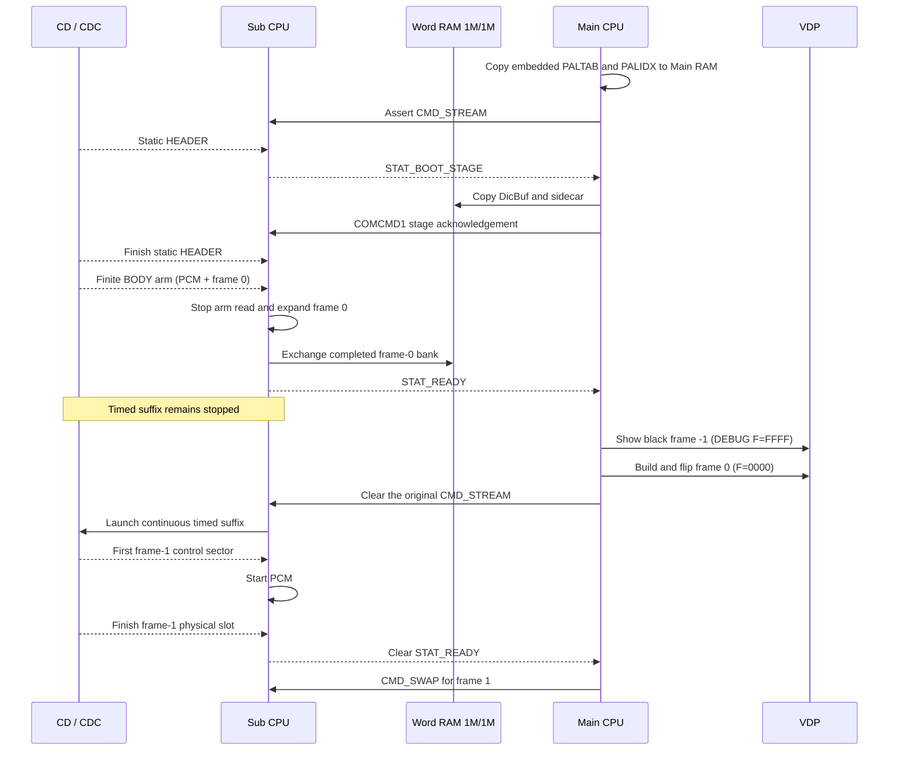
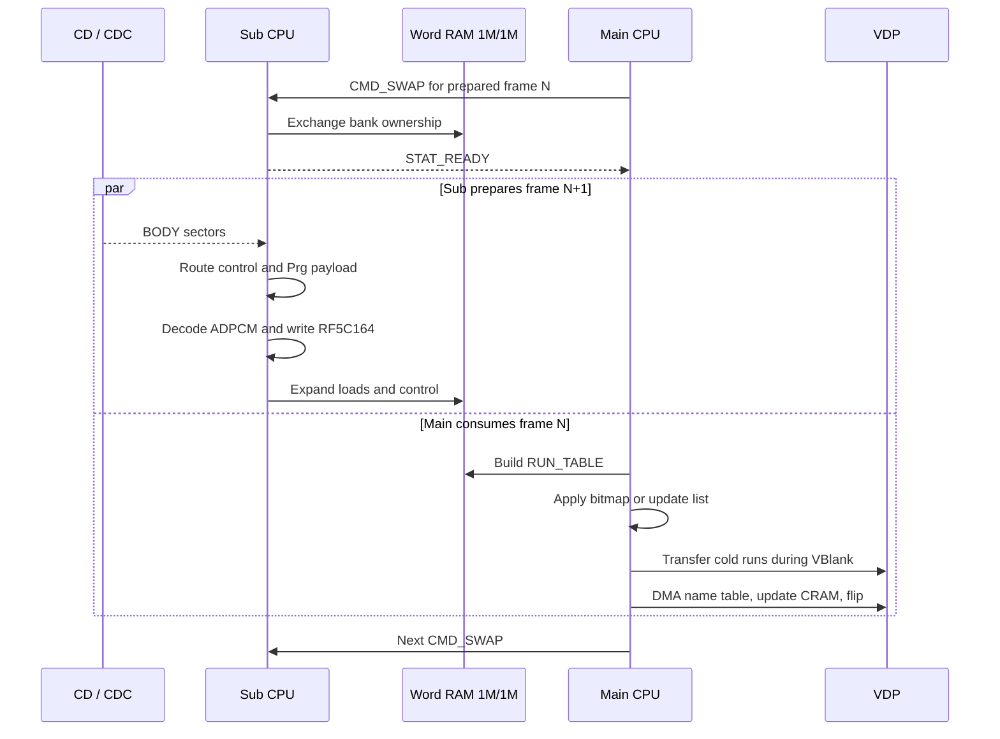
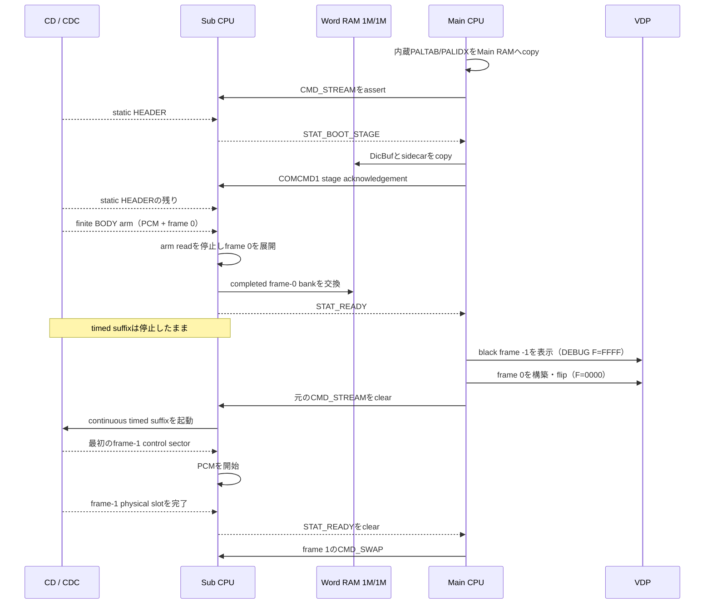
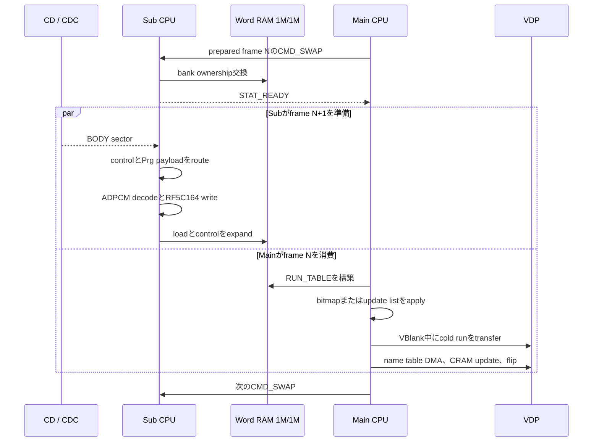

EN / [JP](#jp)

# Player Memory Maps and Runtime Sequence

This document describes the player as currently built: the Sub PRG-RAM,
Word RAM 1M/1M, and Main RAM maps, the startup sequence, and the per-frame
CPU handoff. Each map row carries a short range name (shown as `CODE`) so a
range can be referenced unambiguously in issues, commits, and reviews.

**fps dependence.** Between 15 fps and 30 fps content, the only address-map
difference is the `PRG-BUF` / `JITTER` split inside the fixed
`0x0D000..0x757FF` region; that split is the one place below where both
values are listed side by side. Every other row of every map, and the whole
startup / per-frame sequence, are identical at 15 fps and 30 fps, so a single
value there applies to both rates. Word-RAM WordBuf and routing sizes vary by
profile (frame count, cell count, cold cap), not by fps.

## Unallocated Space Summary

These are the only ranges with no live owner data. Guards, reserves, and
jitter ranges elsewhere in the maps are allocated to their protective role
and are listed in place.

| Domain | Unallocated ranges |
|---|---|
| Sub PRG-RAM | `SCRATCH` 4.50 KiB (rewritten-scratch use is marker-qualified); `HOT-TAIL` 992 B; the `SP-RES` tail, currently 4,032–4,128 B with no loaded content (not qualified as scratch) |
| Word RAM (each bank) | none — every complete sector is assigned; `WB-GAP` is a sector-rounding remainder, not an allocatable range |
| Main RAM | none — the 192 B cushion below `M-STACK` is a guard, not an allocatable range |

## Sub PRG-RAM Map

PRG-RAM is 512 KiB at `0x00000..0x7FFFF`.

| Name | Address | Size | Contents |
|---|---|---:|---|
| `BIOS-LOW` | `0x00000..0x05FFF` | 24.00 KiB | BIOS / low PRG work area |
| `SP-RES` | `0x06000..0x07FFF` | 8.00 KiB | BIOS-loaded resident specialized SP image; current builds load 4,064–4,160 B, the tail has no loaded content (see below) |
| `PCM-BUF` | `0x08000..0x085FF` | 1.50 KiB | live decoded ADPCM buffer |
| `SCRATCH` | `0x08600..0x097FF` | 4.50 KiB | unassigned marker-verified scratch range; not persistent across startup reads |
| `BIOS-CD` | `0x09800..0x0BFFF` | 10.00 KiB | BIOS-touched during continuous reads |
| `ADP-IDX` | `0x0C000..0x0CB1F` | 2.781 KiB | persistent ADPCM next-index table |
| `ADP-OUT` | `0x0CB20..0x0CC1F` | 256 B | persistent ADPCM output lookup table |
| `HOT-TAIL` | `0x0CC20..0x0CFFF` | 992 B | unused tail of the reserved hot-table page |
| `PRG-BUF` | fps split, see next table | 376 / 396 KiB | streamed PrgBuf normal ceiling |
| `JITTER` | fps split, see next table | 40 / 20 KiB | live delivery-jitter reserve above the scheduled ceiling |
| `OBS-GUARD` | `0x75000..0x757FF` | 2.00 KiB | observation guard below pump back-pressure |
| `OVF-GUARD` | `0x75800..0x767FF` | 4.00 KiB | physical PrgBuf overflow guard |
| `WORD-PENDING3` | `0x76800..0x76FFF` | 2.00 KiB | fourth pending Word sector during playback; the boot-only extension executes here before this range assumes its live role |
| `APPLY` | `0x77000..0x7F7FF` | 34.00 KiB | APPLY circular queue |
| `SUB-STACK` | `0x7F800..0x7FEFF` | 1.75 KiB | Sub stack reserve |
| `STACK-TOP` | `0x7FF00..0x7FFFF` | 256 B | area above the configured stack top |

### `PRG-BUF` / `JITTER` fps split

The physical bounds are fixed at every fps: the PrgBuf ring is 422 KiB at
`0x0D000..0x767FF`, pump back-pressure begins at 418 KiB, and the delivery
observation boundary is 416 KiB (`..0x74FFF`). Inside that fixed region the
normal/scheduled ceiling and the jitter reserve move with content cadence:

```text
normal PrgBuf KiB = 416 - cadence reserve KiB
cadence reserve KiB = ceil(20 * 30 / fps)
```

| Item | 15 fps | 30 fps |
|---|---|---|
| cadence reserve | 40 KiB | 20 KiB |
| `PRG-BUF` normal / scheduled ceiling | 376 KiB | 396 KiB |
| `PRG-BUF` address | `0x0D000..0x6AFFF` | `0x0D000..0x6FFFF` |
| `JITTER` address | `0x6B000..0x74FFF` | `0x70000..0x74FFF` |

Other rates follow the same formula (24 fps: reserve 25 KiB, ceiling 391 KiB,
`PRG-BUF` = `0x0D000..0x6EBFF`). The values come from
`cadence_jitter_reserve_kb()`, `prg_buf_cap_kb()`, and
`scheduled_delivery_cap_kb()` in `tools/av_config.py`; this document defines
no independent capacity. The `JITTER` reserve is kept for live sector-arrival
variation and is never encoder Supply.

### `SP-RES` usage

The 32 KiB disc system area places the SP source at offset `0x06000` and
reserves its final 8 KiB. The BIOS loads the exact linked size contiguously
at Sub PRG `0x06000`; it is not limited to one 4 KiB sector pair. The image
is profile-specialized (`PLAYER_SPECIALIZE`), so its exact size is per build;
the current profile builds measure 4,064–4,160 bytes
(`tmp/PROFILE/build/movieplay_sp.bin`). The remaining 4,032–4,128 bytes of
the reservation receive no loaded content: the BIOS load writes only the
linked prefix, and only that prefix is playback-qualified.

The packer places the exact 216-byte hash-bound extension after the
8,800-byte ADPCM table in its existing five-sector padding. Sub stages that
image at `SP-STAGE` (`0x7B000`) and runs the extension from `0x7D260` in two
ways: its qualified first 88 bytes run from `EXT-RUN` (`0x76800`, the unused
timed-ring tail); when routing is at most 8 KiB, the second entry runs in
place at `0x7D2B8` after prebuffer, while longer-route builds copy the
complete extension first. These boot-only entries install ADPCM tables and
prepare routing plus the initial ring/APPLY/frame state. Frame-0 staging may
then overwrite both temporary extension locations. The H40 G measurement and
its two state words remain inline in the resident SP; the full `HOT-TAIL`
range is unused.

### Boot-only overlays

| Name | Address | Phase |
|---|---|---|
| `ISO-SCR` | `0x67000..0x76FFF` | 64 KiB scratch image during ISO discovery only |
| `F0-STAGE` | `0x72000..0x7AFFF` | frame-0 pattern staging |
| `SP-STAGE` | `0x7B000..` | staged SP image containing the extension source |
| `EXT-RUN` | `0x76800..0x768D7` | boot-only extension execution window inside `OVF-GUARD` |

`ISO-SCR` and `F0-STAGE` may overlap the timed ring tail, and `F0-STAGE` may
also overlap `APPLY`, because those timed owners are inactive in each boot
phase. Neither overlay changes the timed map.

The APPLY queue retains deliberate back-pressure headroom; its unused
instantaneous occupancy is not a fixed allocation.

## Word RAM 1M/1M Map

There are two independent 128 KiB physical banks. Sub owns one bank while
Main owns the other. A bank swap exchanges ownership; it does not make one
copy simultaneously visible to both CPUs. This map varies by profile, not by
fps.

`tools/pattern_supply.py` derives the map from frame count, cell count, and
cold cap. Routing occupies `ceil(frames / 2048) * 2048` bytes at the bank
end. The fixed tail is packed immediately below routing:

| Name | Relative order, high to low | Size | Contents |
|---|---|---:|---|
| `ROUTE` | bank end | variable, sector-rounded | resident routing table |
| `TAIL-GAP` | below routing | 1,536 B | unallocated A/B-stable guard; not feature memory |
| `ADP-TBL` | next | 8,800 B | A/B-stable ADPCM reservation; only the 5,696-byte signed-delta portion is populated |
| `SECT-STG` | next | 2,048 B | CD-sector stage / pad discard |
| `CTRL-SCR` | next | 8,192 B | linear control scratch |
| `DBG-HDR` | next | 256 B | DEBUG counters and copied header |

The front of each bank starts with `W-HDR` (the reserved `O_PALW` word and
`O_NLOAD`, four bytes total; palette switches are M-PALIDX driven), followed
by `LOADS` (`O_LOADS`). Main reads name updates
directly from `CTRL-SCR`; `O_CRAM`, `O_NUPD`, and `O_UPDS` do not exist.

`WORDBUF` starts after the parity-specific `LOADS` envelope and ends before
the fixed tail. Wr0 reserves one frame-0 run containing every encoded cell.
Wr1 reserves 32 pattern bytes plus one four-byte descriptor for every allowed
timed cold pattern. Each capacity is rounded down to complete 2 KiB preload
sectors, so disc-sector padding cannot overwrite the fixed tail; the rounding
remainder is `WB-GAP`.

For a 6,576-frame, 40x28-cell, cold-180 example:

| Bank item | Wr0 / frame-0 bank | Wr1 / timed-only bank |
|---|---:|---:|
| `LOADS` envelope | 35,844 B | 6,480 B |
| `WORDBUF` range | `+0x08C20..+0x18C1F` | `+0x01960..+0x1895F` |
| `WORDBUF` capacity | 2,048 patterns | 2,944 patterns |
| `WB-GAP` sector-rounding remainder | 640 B | 1,344 B |

`ROUTE` is 8 KiB in this example and starts at `+0x1E000`. The combined
`WORDBUF` capacity is 4,992 patterns. The two regions contain different
parity-selected streams.

During boot, `BOOT-STG` uses `+0x0000..+0x5FFF` for the optional boot-VRAM
sidecar records; `DIC-STG` uses `+0x6000..+0x9FFF` for DicBuf staging. The
palette table and switch table are not staged here: the Main-IP image embeds
`paltab.bin` / `palidx.bin` and copies both to `M-PALTAB` / `M-PALIDX` at
entry, before generated code reuses the transient `.startup` area. Sub
gives the staging bank to Main, Main copies the dictionary and optional VRAM
sidecar to their persistent homes, and Main returns the bank. Sub stops `HEADER.DAT` before
this handoff and restarts at the exact first unread sector after the return,
so the copy interval cannot create a sector slip. Sub then reads the finite
untimed BODY arm and expands frame 0; frame 0 and `WORDBUF` may overwrite the
temporary staging range safely. Dump diagnostics write list-form updates into
`CTRL-SCR`.

## Main RAM Map

Main RAM is `0xFF0000..0xFFFFFF`. This map is completely fixed: it is
identical in every build, profile, and fps. Generated code grows upward and is
build-time checked against the `M-STATE` base.

| Name | Address | Size | Contents |
|---|---|---:|---|
| `M-CODE` | `0xFF0000..0xFF65FF` | 25.50 KiB | permanent player, transient boot UI, generated handlers and guard |
| `M-STATE` | `0xFF6600..0xFF87FF` | 8.50 KiB | BSS, shadow, DEBUG HUD row, name-table stage, state; worst-case fixed reserve |
| `M-RUNTBL` | `0xFF8800..0xFFB1FF` | 10.50 KiB | 488-entry pre-swizzled RUN_TABLE |
| `M-PALTAB` | `0xFFB200..0xFFB9FF` | 2.00 KiB | 16-entry PALTAB (player-embedded paltab.bin) |
| `M-PALIDX` | `0xFFBA00..0xFFBA3F` | 64 B | 16-entry palette-switch table, 15 switches + sentinel (player-embedded palidx.bin) |
| `M-DIC` | `0xFFBA40..0xFFFA3F` | 16.00 KiB | 512-pattern persistent DicBuf |
| guard | `0xFFFA40..0xFFFAFF` | 192 B | cushion below the stack guard |
| `M-STACK` | `0xFFFB00..0xFFFCFF` | 512 B | stack and interrupt reserve |
| `M-TOP` | `0xFFFD00..0xFFFFFF` | 768 B | area above stack top / BIOS reserve |

The realized generated-code end inside `M-CODE`, the realized `.bss` end
inside `M-STATE`, and the realized RUN_TABLE maximum inside `M-RUNTBL` vary
per build and profile; build-time assertions keep each inside its fixed
range.

## Startup and Per-Frame CPU Sequence

The sequences below are identical at 15 fps and 30 fps; only the frame period
differs.

### Startup

One `CMD_STREAM` command spans the complete startup. The BOOT_STAGE ownership
exchange still uses `STAT_BOOT_STAGE` plus `COMCMD1`, because Main must copy
palette, switch table, dictionary, and sidecar data before Sub reuses that physical bank.
There is no separate frame-0/BODY-start handshake.

`STAT_READY` exposes the completed frame-0 bank while the timed CD reader is
still stopped. Clearing the original command after the visible frame-0 flip
launches timed BODY service. PCM stays stopped through `ROM_READN` startup and
begins when the first frame-1 control sector arrives. Sub finishes that
physical slot before acknowledging the clear, so its remainder and the next
VBlank form the normal frame-0-to-frame-1 interval. Frame -1 therefore creates
no unplanned PrgBuf lead, and the CD startup interval does not advance audio.



Frame -1 is a player/HUD state only. It does not add a sim frame, a control
block, a routing entry, or a HUD TSV row.

### Timed playback

After a bank swap, Main consumes frame `N` while Sub prepares frame `N+1`.



For specialized fixed-N H40 playback, one transfer deadline can serve both
the final cold-run tail and the display flip. The Main CPU treats 3,400 words
as the usable pattern-transfer budget for a VBlank, and grants that full
budget only after waiting for a new VBlank or while the V counter is still on
its first blank line (`E0`). Entering an already-running blank later never
creates a full budget; Main waits for the next head.

The shared path is taken only when the remaining word budget covers the
complete 64-by-28 name-table DMA (1,792 words), a 128-word timing guard, the
63-word DEBUG HUD republish when present, and the optional 64-word CRAM
replacement. The resulting reserves are 1,920 words in release or 1,983 words
in DEBUG, plus 64 words for a palette switch. VBlank status is checked before
and after the V counter, and the terminal `FC..FF` lines are rejected. If any
condition fails, Main waits for a fresh VBlank before the name-table DMA and
flip. This shares one physical deadline without treating a mid-blank entry as
unused capacity. A DMA run that crosses the current pattern budget is split at
that boundary rather than abandoning the first blank's residual capacity.
One- or two-tile CPU-write runs remain whole and can leave at most 32 words
unused.

Sub wait loops service a pending `CMD_SWAP` before another opportunistic
sector pump. CD pumping continues while Main is genuinely idle, but future
payload work cannot delay an already-pending handoff.

## Reproducing the Map Measurements

Use the managed Python environment and an explicit profile:

```sh
tools/python.sh tools/check_player_ring.py \
  --constants out/PROFILE/player_constants.inc \
  --extension tmp/PROFILE/build/movieplay_sp_ext.bin \
  --extension-constants tmp/PROFILE/build/sp_extension.inc
make movieplay CONFIG=profiles/PROFILE.toml \
  DEBUG=1 MAIN_CODEGEN=1 DMA_RUN_FASTPATH=1 PLAYER_SPECIALIZE=1

~/toolchains/mars/m68k-elf/bin/m68k-elf-size -A \
  tmp/PROFILE/build/movieplay_ip.o \
  tmp/PROFILE/build/movieplay_sp.o
```

The `SP-RES` loaded size is the linked size of
`tmp/PROFILE/build/movieplay_sp.bin`. Rebuild, pack with verification, and
complete the DEBUG recording and HUD gate before revising any address or
size in this document.

---

<a id="jp"></a>

# Player memory mapとruntime sequence

この文書は、現在ビルドされているplayerをそのまま記述します。Sub PRG-RAM、
Word RAM 1M/1M、Main RAMのmap、startup sequence、frameごとのCPU handoffが
対象です。各map行には短いrange名（`CODE`表記）を付けており、issue・commit・
reviewでrangeを曖昧さなく参照できます。

**fps依存について。** 15 fpsと30 fpsのcontentの間でaddress mapが変わるのは、
固定領域`0x0D000..0x757FF`内部の`PRG-BUF` / `JITTER`分割だけです。その分割
だけを後述の表で両値併記します。それ以外のすべてのmap行とstartup / per-frame
sequence全体は15 fpsと30 fpsで同一なので、単一値はそのまま両方に適用されます。
Word RAMのWordBufとrouting sizeはprofile（frame数、cell数、cold cap）で変わる
ものであり、fpsでは変わりません。

## 未割当領域の要約

live ownerのdataを持たないrangeは次だけです。map中のguard・reserve・jitter
rangeは保護役として割り当て済みであり、各mapの該当行に記載しています。

| Domain | 未割当range |
|---|---|
| Sub PRG-RAM | `SCRATCH` 4.50 KiB（書き直しscratch利用はmarker検証済み）。`HOT-TAIL` 992 B。`SP-RES`のtail、現在4,032–4,128 Bでloaded contentなし（scratchとしては未検証） |
| Word RAM（各bank） | なし。完全なsectorはすべて割当済み。`WB-GAP`はsector丸めの余りで、割当可能なrangeではない |
| Main RAM | なし — `M-STACK` 直下の192 Bクッションはguardであり割当可能領域ではない |

## Sub PRG-RAM map

PRG-RAMは`0x00000..0x7FFFF`の512 KiBです。

| Name | Address | Size | 内容 |
|---|---|---:|---|
| `BIOS-LOW` | `0x00000..0x05FFF` | 24.00 KiB | BIOS / low PRG work area |
| `SP-RES` | `0x06000..0x07FFF` | 8.00 KiB | BIOS-loadされるresident specialized SP image。現在のbuildは4,064–4,160 Bをloadし、tailにはloaded contentがない（後述） |
| `PCM-BUF` | `0x08000..0x085FF` | 1.50 KiB | live decoded ADPCM buffer |
| `SCRATCH` | `0x08600..0x097FF` | 4.50 KiB | 未割当のmarker検証済みscratch range。startup readを越える永続保持は不可 |
| `BIOS-CD` | `0x09800..0x0BFFF` | 10.00 KiB | continuous read中にBIOSが使用 |
| `ADP-IDX` | `0x0C000..0x0CB1F` | 2.781 KiB | persistent ADPCM next-index table |
| `ADP-OUT` | `0x0CB20..0x0CC1F` | 256 B | persistent ADPCM output lookup table |
| `HOT-TAIL` | `0x0CC20..0x0CFFF` | 992 B | hot-table予約pageの未使用tail |
| `PRG-BUF` | fps分割、次表参照 | 376 / 396 KiB | streamed PrgBufのnormal上限 |
| `JITTER` | fps分割、次表参照 | 40 / 20 KiB | scheduled上限より上のlive delivery-jitter予約 |
| `OBS-GUARD` | `0x75000..0x757FF` | 2.00 KiB | pump back-pressure前の観測guard |
| `OVF-GUARD` | `0x75800..0x767FF` | 4.00 KiB | physical PrgBuf overflow guard |
| `WORD-PENDING3` | `0x76800..0x76FFF` | 2.00 KiB | playback中の4本目pending Word sector。boot-only extensionはlive用途へ移る前にこの範囲で実行 |
| `APPLY` | `0x77000..0x7F7FF` | 34.00 KiB | APPLY circular queue |
| `SUB-STACK` | `0x7F800..0x7FEFF` | 1.75 KiB | Sub stack reserve |
| `STACK-TOP` | `0x7FF00..0x7FFFF` | 256 B | configured stack topより上 |

### `PRG-BUF` / `JITTER`のfps分割

物理境界はすべてのfpsで固定です。PrgBuf ringは`0x0D000..0x767FF`の422 KiB、
pump back-pressureは418 KiBで始まり、delivery観測境界は416 KiB
（`..0x74FFF`）です。この固定領域の内部で、normal/scheduled上限とjitter予約
がcontent cadenceに応じて動きます。

```text
normal PrgBuf KiB = 416 - cadence reserve KiB
cadence reserve KiB = ceil(20 * 30 / fps)
```

| 項目 | 15 fps | 30 fps |
|---|---|---|
| cadence reserve | 40 KiB | 20 KiB |
| `PRG-BUF` normal / scheduled上限 | 376 KiB | 396 KiB |
| `PRG-BUF` address | `0x0D000..0x6AFFF` | `0x0D000..0x6FFFF` |
| `JITTER` address | `0x6B000..0x74FFF` | `0x70000..0x74FFF` |

他のrateも同じ式に従います（24 fps: reserve 25 KiB、上限391 KiB、
`PRG-BUF` = `0x0D000..0x6EBFF`）。数値は`tools/av_config.py`の
`cadence_jitter_reserve_kb()`、`prg_buf_cap_kb()`、
`scheduled_delivery_cap_kb()`から得ます。この文書では独立した容量を定義
しません。`JITTER`予約はliveのsector到着変動のために保持され、encoder
Supplyになることはありません。

### `SP-RES`の使用量

32 KiB disc system areaはSP sourceをoffset `0x06000`へ置き、最後の8 KiBを
予約します。BIOSは正確なlinked sizeをSub PRG `0x06000`へ連続loadし、
1組の4 KiB sectorには制限されません。imageはprofile-specialized
（`PLAYER_SPECIALIZE`）なので正確なsizeはbuildごとに決まり、現在のprofile
buildでは4,064–4,160 byteです（`tmp/PROFILE/build/movieplay_sp.bin`）。
予約の残り4,032–4,128 byteにはloaded contentが入りません。BIOS loadは
linked prefixだけを書き込み、そのprefixだけがplayback-qualifiedです。

Packerはhashで固定した216-byte extensionを8,800-byte ADPCM table直後の既存
5-sector paddingへ配置します。Subはそのimageを`SP-STAGE`（`0x7B000`）へ
stageし、`0x7D260`のextensionを2通りに使います。qualified済み先頭88 byteは
`EXT-RUN`（未使用timed-ring tailの`0x76800`）で実行します。routingが8 KiB
以下なら第2入口をprebuffer後に`0x7D2B8`でそのまま実行し、長いroutingの
buildはextension全体を先にcopyします。これらのboot-only入口がADPCM install、
routing prepare、初期ring/APPLY/frame stateを設定します。その後はframe-0
stagingが両temporary extension locationを上書きできます。H40のG測定と2つの
state wordはresident SP内にinlineで残り、`HOT-TAIL` range全体は未使用です。

### Boot-only overlay

| Name | Address | Phase |
|---|---|---|
| `ISO-SCR` | `0x67000..0x76FFF` | ISO discovery中だけの64 KiB scratch image |
| `F0-STAGE` | `0x72000..0x7AFFF` | frame-0 pattern staging |
| `SP-STAGE` | `0x7B000..` | extension sourceを含むstaged SP image |
| `EXT-RUN` | `0x76800..0x768D7` | `OVF-GUARD`内部のboot-only extension実行window |

各boot phaseではtimed ownerがinactiveなので、`ISO-SCR`と`F0-STAGE`はtimed
ring tailと重複でき、`F0-STAGE`は`APPLY`とも重複できます。どちらのoverlayも
timed mapを変えません。

APPLY queueには意図的なback-pressure headroomがあります。瞬間的な未使用
occupancyは固定allocationではありません。

## Word RAM 1M/1M map

128 KiBの独立したphysical bankが2つあります。Subが一方を所有するときMainは
他方を所有します。Bank swapはownershipを交換するだけで、同じcopyを両CPUへ
同時公開しません。このmapはprofileで変わり、fpsでは変わりません。

`tools/pattern_supply.py`がframe数、cell数、cold capからmapを導出します。
Routingはbank末尾に`ceil(frames / 2048) * 2048` byteを使います。Fixed tail
はroutingの直下へ次の順で詰めます。

| Name | 上から下への相対順 | Size | 内容 |
|---|---|---:|---|
| `ROUTE` | bank末尾 | 可変、sector丸め | resident routing table |
| `TAIL-GAP` | routing直下 | 1,536 B | 未割当のA/B-stable guard。feature memoryではない |
| `ADP-TBL` | 次 | 8,800 B | A/B-stable ADPCM予約。実際に配置するのは5,696-byte signed-delta部分だけ |
| `SECT-STG` | 次 | 2,048 B | CD-sector stage / pad discard |
| `CTRL-SCR` | 次 | 8,192 B | linear control scratch |
| `DBG-HDR` | 次 | 256 B | DEBUG counterとcopied header |

各bankの先頭は`W-HDR`（reservedの`O_PALW` wordと`O_NLOAD`、合計4 byte。palette
切替はM-PALIDX起点）、続いて`LOADS`（`O_LOADS`）です。Mainはname updateを`CTRL-SCR`から直接読むため、
`O_CRAM`、`O_NUPD`、`O_UPDS`は存在しません。

`WORDBUF`はparity別`LOADS` envelopeの直後からfixed tailの手前までです。Wr0
は全encoded cellを含むframe-0の1 runを予約します。Wr1はtimed cold上限の各
patternにつき32 pattern byteと4 byte descriptorを予約します。容量は完全な
2 KiB preload sectorへ切り下げるため、disc sectorのpadはfixed tailを上書き
しません。丸めの余りが`WB-GAP`です。

6,576 frame、40x28 cell、cold 180の例は次のとおりです。

| Bank item | Wr0 / frame-0 bank | Wr1 / timed-only bank |
|---|---:|---:|
| `LOADS` envelope | 35,844 B | 6,480 B |
| `WORDBUF` range | `+0x08C20..+0x18C1F` | `+0x01960..+0x1895F` |
| `WORDBUF` capacity | 2,048 patterns | 2,944 patterns |
| `WB-GAP` sector丸めの余り | 640 B | 1,344 B |

この例の`ROUTE`は8 KiBで、`+0x1E000`から始まります。`WORDBUF`合計容量は
4,992 patternsです。2つのregionにはparity別の異なるstreamが入ります。

Boot中は`BOOT-STG`が`+0x0000..+0x5FFF`（optionalなboot-VRAM sidecar record専用）、
`DIC-STG`が`+0x6000..+0x9FFF`をDicBuf stagingに使います。palette表と切替表は
ここにstageしません: Main-IP imageが`paltab.bin` / `palidx.bin`を内蔵し、生成
codeが一時`.startup`領域を再利用する前のentry直後に`M-PALTAB` / `M-PALIDX`へ
copyします。Subがstaging bankをMainへ渡し、Mainはdictionaryと任意のVRAM
sidecarをpersistentな保存先へcopyしてbankを返します。Subはhandoff前に`HEADER.DAT`を停止し、返却後に正確な最初の
未読sectorから再開するため、copy intervalがsector slipを発生させません。
続いてSubは有限でuntimedなBODY armを読み、frame 0を展開します。その後は
frame 0と`WORDBUF`がtemporary stage rangeを安全に上書きできます。Dump
diagnosticはlist形式のupdateを`CTRL-SCR`へ書きます。

## Main RAM map

Main RAMは`0xFF0000..0xFFFFFF`です。このmapは完全固定で、すべてのbuild・
profile・fpsで同一です。Generated codeは上方向へ伸び、`M-STATE` baseに対して
build-time checkされます。

| Name | Address | Size | 内容 |
|---|---|---:|---|
| `M-CODE` | `0xFF0000..0xFF65FF` | 25.50 KiB | permanent player、transient boot UI、generated handler、guard |
| `M-STATE` | `0xFF6600..0xFF87FF` | 8.50 KiB | BSS、shadow、DEBUG HUD row、name-table stage、state。最悪ケース固定予約 |
| `M-RUNTBL` | `0xFF8800..0xFFB1FF` | 10.50 KiB | 488-entry pre-swizzled RUN_TABLE |
| `M-PALTAB` | `0xFFB200..0xFFB9FF` | 2.00 KiB | 16-entry PALTAB（player内蔵paltab.bin） |
| `M-PALIDX` | `0xFFBA00..0xFFBA3F` | 64 B | 16-entry palette切替表、15切替+番兵（player内蔵palidx.bin） |
| `M-DIC` | `0xFFBA40..0xFFFA3F` | 16.00 KiB | 512-pattern persistent DicBuf |
| guard | `0xFFFA40..0xFFFAFF` | 192 B | stack guard直下のクッション |
| `M-STACK` | `0xFFFB00..0xFFFCFF` | 512 B | stackとinterrupt reserve |
| `M-TOP` | `0xFFFD00..0xFFFFFF` | 768 B | stack topより上 / BIOS reserve |

`M-CODE`内の実generated-code末尾、`M-STATE`内の実`.bss`末尾、`M-RUNTBL`内の
実RUN_TABLE最大値はbuildとprofileごとに変わり、build-time assertionが各固定
rangeの内側に保ちます。

## StartupとframeごとのCPU sequence

以下のsequenceは15 fpsと30 fpsで同一で、frame周期だけが異なります。

### Startup

1個の`CMD_STREAM` commandがstartup全体を通してassertされたままです。
BOOT_STAGEのownership交換には引き続き`STAT_BOOT_STAGE`と`COMCMD1`を使います。
Subが同じ物理bankを再利用する前に、Mainがpalette、切替表、dictionary、sidecar data
をcopyする必要があるためです。frame-0/BODY-start専用の2個目のhandshakeは
ありません。

`STAT_READY`は完成したframe-0 bankを公開しますが、この時点ではtimed CD
readerを停止したままにします。frame 0を実際にflipした後で元のcommandを
clearするとtimed BODY serviceを起動します。`ROM_READN` の起動中はPCMを停止したままにし、
最初のframe-1 control sector到着時にPCMを開始します。Subはそのphysical slotを最後まで
drainしてからclearをacknowledgeするため、slotの残り時間と次のVBlankが通常の
frame-0-to-frame-1 intervalになります。したがってframe -1は計画外のPrgBuf先行量を
作らず、CD起動待ちも音声を進めません。



frame -1はplayer/HUDだけのstateです。sim frame、control block、routing
entry、HUD TSV rowは追加しません。

### Timed playback

Bank swap後、Mainはframe `N`を消費し、Subは他方のbankでframe `N+1`を準備
します。



Specialized fixed-N H40再生では、1個のtransfer deadlineを最後のcold-run tailと
display flipで共有できます。Main CPUは1 VBlankでpattern transferに使用できる
budgetを3,400 wordとし、新しいVBlankを待った直後、またはV counterが最初のblank
line（`E0`）にある場合だけfull budgetを与えます。すでに進行中のblankへそれより
遅く入った場合はfull budgetを作らず、次のheadを待ちます。

Shared pathを使うのは、残りword budgetが64-by-28 name-table DMA全体（1,792
word）、128-word timing guard、存在する場合の63-word DEBUG HUD republish、任意の
64-word CRAM replacementを覆う場合だけです。そのreserveはreleaseで1,920 word、
DEBUGで1,983 word、palette switch時はさらに64 wordです。VBlank statusはV
counterの前後で確認し、terminalの`FC..FF` lineは拒否します。どれかの条件を
満たさない場合、Mainはname-table DMAとflipの前にfresh VBlankを待ちます。これに
より、mid-blank entryを未使用capacityと見なさずに、1個のphysical deadlineを共有
します。Current pattern budgetをまたぐDMA runは、最初のblankの残りcapacityを
捨てず、そのboundaryで分割します。1～2 tileのCPU-write runは分割せず、未使用に
なるのは最大32 wordです。

Sub wait loopは、別のopportunistic sector pumpより先にpending `CMD_SWAP`を
処理します。Mainが本当にidleな間はCD pumpを続けますが、将来payloadの処理が
pending handoffを遅らせることはできません。

## Map測定値の再現

Managed Python環境と明示的なprofileを使います。

```sh
tools/python.sh tools/check_player_ring.py \
  --constants out/PROFILE/player_constants.inc \
  --extension tmp/PROFILE/build/movieplay_sp_ext.bin \
  --extension-constants tmp/PROFILE/build/sp_extension.inc
make movieplay CONFIG=profiles/PROFILE.toml \
  DEBUG=1 MAIN_CODEGEN=1 DMA_RUN_FASTPATH=1 PLAYER_SPECIALIZE=1

~/toolchains/mars/m68k-elf/bin/m68k-elf-size -A \
  tmp/PROFILE/build/movieplay_ip.o \
  tmp/PROFILE/build/movieplay_sp.o
```

`SP-RES`のloaded sizeは`tmp/PROFILE/build/movieplay_sp.bin`のlinked size
です。この文書のaddressやsizeを改訂する前に、rebuild、verify付きpack、
DEBUG recording、HUD gateを完了します。
