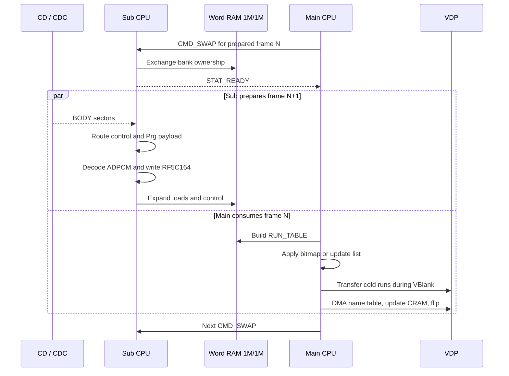
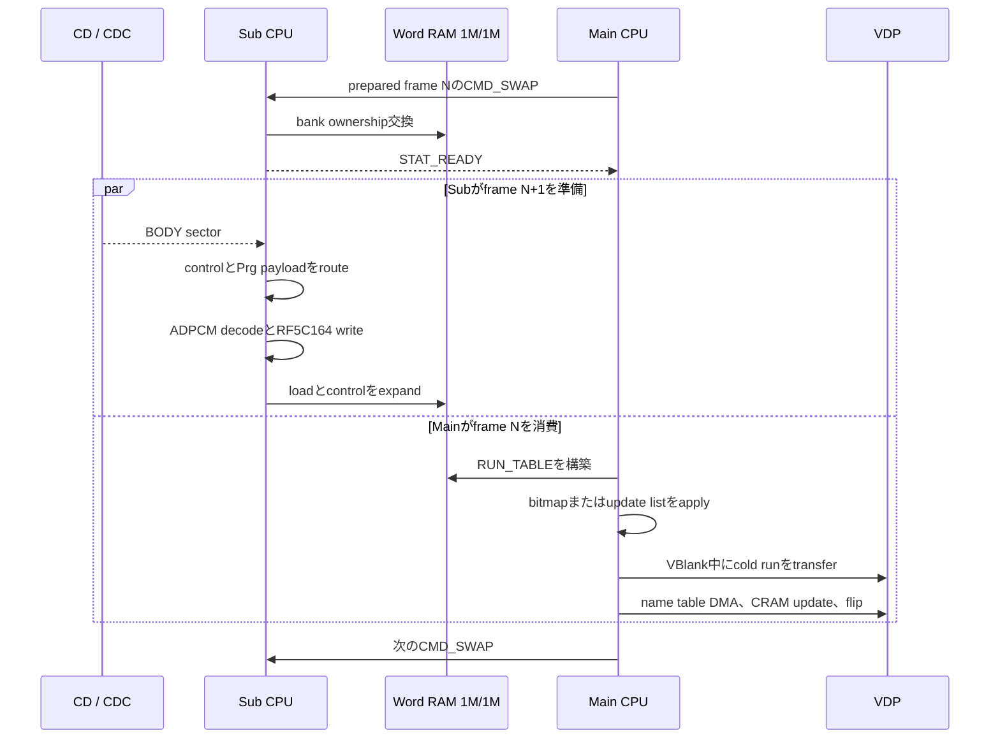

EN / [JP](#jp)

# Streaming Memory and CPU Headroom

This document answers one planning question: **what memory and CPU time can a
live-playback feature use without consuming an existing safety margin?**

The conservative answer is:

| Domain | Unconditional fixed space | Conditional space |
|---|---:|---:|
| Sub PRG-RAM | 6.00 KiB | 2 bytes of Sub boot-slot code growth; not data RAM |
| each physical Word-RAM bank | 10.64 KiB in separate holes | 5.75 KiB only if dump diagnostics are removed or relocated |
| Main RAM | 2.627 KiB | generated-code and RUN_TABLE tails only with profile-specific assertions |
| Main CPU | 0 guaranteed cycles | measured profile evidence is not a reusable allowance |
| Sub CPU | 0 guaranteed cycles | measured decode time excludes variable BIOS, CD, bus, and bank waits |

“Unconditional” means that the range survives frame 0, movie replay, the
largest supported control block, the physical run-table limit, and both
Word-RAM bank parities. Any larger scratch allocation requires a specific
lifetime and a full validation of every overlapping phase.

## Safety Rules

- Do not count PrgBuf jitter, overflow, APPLY back-pressure, stack, or
  generated-code guards as free memory.
- Do not add Main and Sub arithmetic remainders together. They execute
  concurrently and synchronize at the Word-RAM handoff.
- BIOS calls, CDC readiness, VBlank phase, DMA completion, shared-memory
  access, and bank settling have no finite instruction-only bound.
- Treat a successful recording as evidence for that exact stream and build,
  not as a general CPU budget.
- Give every new allocation a named address range and a build-time overlap
  assertion.

## Sub PRG-RAM Map

PRG-RAM is 512 KiB at `0x00000..0x7FFFF`.

| Address | Size | Owner | New feature use |
|---|---:|---|---|
| `0x00000..0x05FFF` | 24.00 KiB | BIOS / low PRG work area | No |
| `0x06000..0x06FFD` | 4,094 B | specialized Sub boot image slot | No |
| `0x06FFE..0x06FFF` | 2 B | boot-slot remainder | Code growth only |
| `0x07000..0x07FFF` | 4.00 KiB | boot ISO scratch and BIOS-unsafe streaming range | No |
| `0x08000..0x097FF` | **6.00 KiB** | unassigned, marker-verified safe range | **Yes, after adding an overlap check** |
| `0x09800..0x0BFFF` | 10.00 KiB | BIOS-touched during continuous reads | No |
| `0x0C000..0x70FFF` | 404.00 KiB | normal PrgBuf capacity at the largest cadence reserve | No |
| `0x71000..0x75FFF` | 20.00 KiB | delivery-jitter headroom and frame-0 staging | No |
| `0x76000..0x76FFF` | 4.00 KiB | physical PrgBuf overflow guard | No |
| `0x77000..0x7F7FF` | 34.00 KiB | APPLY circular queue | No |
| `0x7F800..0x7FEFF` | 1.75 KiB | Sub stack reserve | No |
| `0x7FF00..0x7FFFF` | 256 B | area above the configured stack top | No |

The physical PrgBuf ring is 428 KiB. Its normal scheduling cap is below the
422 KiB delivery ceiling by a cadence-scaled jitter reserve. Pump
back-pressure begins below the physical end, and the remaining 4 KiB is a
separate overflow guard. None of these differences is feature memory.

The APPLY queue also retains deliberate back-pressure headroom. Its unused
instantaneous occupancy is not a fixed allocation.

## Word RAM 1M/1M Map

There are two independent 128 KiB physical banks. Sub owns one bank while Main
owns the other. A bank swap exchanges ownership; it does not make one copy
simultaneously visible to both CPUs.

The following offset map applies to each physical bank:

| Bank offset | Size | Owner / maximum use | Fixed headroom |
|---|---:|---|---:|
| `+0x00000..+0x00083` | 132 B | palette reference, CRAM reserve, `n_load` | 0 |
| `+0x00084..+0x097FF` | 37.87 KiB | cold load runs; frame 0 can use 35,844 B | 2.87 KiB |
| `+0x09800..+0x09801` | 2 B | `n_upd` | 0 |
| `+0x09802..+0x0AEFF` | 5.75 KiB | dump-diagnostic update records | Conditional 5.75 KiB |
| `+0x0AF00..+0x0AFFF` | 256 B | DEBUG counters and copied header | 156 B in fixed holes |
| `+0x0B000..+0x0CFFF` | 8.00 KiB | PALTAB staging | 0 |
| `+0x0D000..+0x0EFFF` | 8.00 KiB | DicBuf boot staging | 0 |
| `+0x0F000..+0x0FFFF` | **4.00 KiB** | tail after maximum DicBuf stage | **4.00 KiB** |
| `+0x10000..+0x11FFF` | 8.00 KiB | linear control scratch; maximum 4,900 B | 3.21 KiB |
| `+0x12000..+0x127FF` | 2.00 KiB | CD-sector stage / pad discard | 0 |
| `+0x12800..+0x14A5F` | 8,800 B | full ADPCM lookup tables | 0 |
| `+0x14A60..+0x14BFF` | **416 B** | alignment gap | **416 B** |
| `+0x14C00..+0x151FF` | 1.50 KiB | decoded ADPCM buffer | 0 |
| `+0x15200..+0x1BFFF` | 27.50 KiB | immutable WordBuf0 or WordBuf1 | 0 |
| `+0x1C000..+0x1FFFF` | 16.00 KiB | resident routing table | 0 |

The unconditional fixed total is:

```text
2.867 KiB  frame-0 load tail
0.152 KiB  status and header holes
4.000 KiB  DicBuf-stage tail
3.215 KiB  control-scratch tail
0.406 KiB  ADPCM alignment gap
-----------
10.640 KiB per physical bank
```

The two WordBuf regions contain different parity-selected streams. Persistent
state that follows every handoff normally needs a copy in both banks.
Parity-local or ping-pong state may intentionally differ.

The dump-diagnostic update area is not used by ordinary playback, but remains
owned until those diagnostics are explicitly removed or relocated.

## Main RAM Map

Main RAM is `0xFF0000..0xFFFFFF`. Generated code grows upward and is build-time
checked against the persistent DicBuf boundary.

| Address | Size | Owner | Fixed headroom |
|---|---:|---|---:|
| `0xFF0000..0xFF65FF` | 25.50 KiB | permanent player, transient boot UI, generated handlers and guard | 0 without build-specific proof |
| `0xFF6600..0xFF85FF` | 8.00 KiB | persistent DicBuf | 0 |
| `0xFF8600..0xFFAFFF` | 10.50 KiB | 488-entry pre-swizzled RUN_TABLE | 0 |
| `0xFFB000..0xFFCFFF` | 8.00 KiB | 64-entry PALTAB | 0 |
| `0xFFD000..0xFFF07D` | 8,318 B | BSS, shadow, DEBUG HUD row, name-table stage, state | 0 |
| `0xFFF07E..0xFFFAFF` | **2.627 KiB** | unused below stack guard | **2.627 KiB** |
| `0xFFFB00..0xFFFCFF` | 512 B | stack and interrupt reserve | 0 |
| `0xFFFD00..0xFFFFFF` | 768 B | area above stack top / BIOS reserve | 0 |

RUN_TABLE space beyond a profile's realized maximum and any gap below
generated code are conditional. They may be used only with symbols and
assertions that preserve the supported cold cap and maximum generated output.

## Per-Frame CPU Sequence

After a bank swap, Main consumes frame `N` while Sub prepares frame `N+1`.



Sub wait loops service a pending `CMD_SWAP` before another opportunistic sector
pump. CD pumping continues while Main is genuinely idle, but future payload
work cannot delay an already-pending handoff.

The Main and Sub stopwatches cover selected phases, not the complete deadline.
DMA, RF5C164 writes, BIOS calls, CDC polls, bank settling, and shared-memory
waits keep the unconditional spendable CPU remainder at zero.

## Allocation Order

Use low-risk space in this order:

1. Use Main RAM `0xFFF07E..0xFFFAFF` for Main-only state and keep the stack
   guard.
2. Use the Word-RAM DicBuf-stage tail or ADPCM alignment gap for small
   bank-local state, with assertions in both banks.
3. Use generated-code or RUN_TABLE tails only with profile-specific end
   symbols and bounds.
4. Use PRG `0x08000..0x097FF` only after adding it to
   `tools/check_player_ring.py`.
5. Reclaim the dump update area only when its diagnostics are removed or moved.

Never allocate from payload jitter, PrgBuf overflow, APPLY back-pressure,
stack, VBlank, or DMA safety reserves.

## CPU Qualification

A sustained new path needs:

- a Sub stopwatch around its work;
- a pack-time Main guard for its worst run or transfer cost;
- full-length recordings for every supported cadence and display mode it
  affects;
- HUD gates with no stream slip, desync, recovery, or unplanned cadence wait;
- stable audio lead and exact decoded frame counts; and
- cycle and memory assertions in the same change as the allocation.

## Reproducing the Audit

Use the managed Python environment and an explicit profile:

```sh
tools/python.sh tools/check_player_ring.py
make movieplay CONFIG=configs/PROFILE.toml \
  DEBUG=1 MAIN_CODEGEN=1 DMA_RUN_FASTPATH=1 PLAYER_SPECIALIZE=1

~/toolchains/mars/m68k-elf/bin/m68k-elf-size -A \
  tmp/PROFILE/build/movieplay_ip.o \
  tmp/PROFILE/build/movieplay_sp.o
```

Rebuild, pack with verification, and complete the DEBUG recording and HUD gate
before revising any elapsed-time or memory-headroom claim.

---

<a id="jp"></a>

# Streaming memoryとCPU余裕

この文書は、**既存の安全余裕を消費せずにlive-playback featureが使えるmemoryとCPU
時間はどれだけか**、というplanning上の問いに答えます。

保守的な回答は次のとおりです。

| Domain | 無条件に固定利用できる領域 | 条件付き領域 |
|---|---:|---:|
| Sub PRG-RAM | 6.00 KiB | Sub boot slotのcode growth 2 byte。data RAMではない |
| 各physical Word-RAM bank | 分離したholeの合計10.64 KiB | dump diagnosticを削除または移動する場合だけ5.75 KiB |
| Main RAM | 2.627 KiB | generated-codeとRUN_TABLEのtailはprofile固有assert付きのみ |
| Main CPU | 保証cycle 0 | Profile実測は再利用可能なallowanceではない |
| Sub CPU | 保証cycle 0 | Decode実測は可変のBIOS、CD、bus、bank waitを含まない |

「無条件」とは、frame 0、movie replay、最大対応control block、物理run-table上限、
両方のWord-RAM bank parityを通して使えることです。それより大きなscratch allocationには、
明示的なlifetimeと、重なる全phaseのvalidationが必要です。

## 安全規則

- PrgBuf jitter、overflow、APPLY back-pressure、stack、generated-code guardを
  free memoryとして数えません。
- MainとSubの算術上の余りを合算しません。両者は並列実行し、Word-RAM handoffで同期します。
- BIOS call、CDC readiness、VBlank phase、DMA completion、shared-memory access、
  bank settleには有限のinstruction-only boundがありません。
- 成功したrecordingはそのstreamとbuildの証拠であり、一般的なCPU予算ではありません。
- 新allocationには名前付きaddress rangeとbuild-time overlap assertionを付けます。

## Sub PRG-RAM map

PRG-RAMは`0x00000..0x7FFFF`の512 KiBです。

| Address | Size | Owner | New featureでの利用 |
|---|---:|---|---|
| `0x00000..0x05FFF` | 24.00 KiB | BIOS / low PRG work area | 不可 |
| `0x06000..0x06FFD` | 4,094 B | specialized Sub boot image slot | 不可 |
| `0x06FFE..0x06FFF` | 2 B | boot-slot remainder | code growthのみ |
| `0x07000..0x07FFF` | 4.00 KiB | boot ISO scratchとBIOS-unsafe streaming range | 不可 |
| `0x08000..0x097FF` | **6.00 KiB** | 未割当でmarker検証済みのsafe range | **overlap check追加後に利用可** |
| `0x09800..0x0BFFF` | 10.00 KiB | continuous read中にBIOSが使用 | 不可 |
| `0x0C000..0x70FFF` | 404.00 KiB | 最大cadence reserve時のnormal PrgBuf capacity | 不可 |
| `0x71000..0x75FFF` | 20.00 KiB | delivery-jitter headroomとframe-0 staging | 不可 |
| `0x76000..0x76FFF` | 4.00 KiB | physical PrgBuf overflow guard | 不可 |
| `0x77000..0x7F7FF` | 34.00 KiB | APPLY circular queue | 不可 |
| `0x7F800..0x7FEFF` | 1.75 KiB | Sub stack reserve | 不可 |
| `0x7FF00..0x7FFFF` | 256 B | configured stack topより上 | 不可 |

Physical PrgBuf ringは428 KiBです。Normal scheduling capは、cadenceに応じたjitter
reserve分だけ422 KiB delivery ceilingより小さくなります。Pump back-pressureはphysical
endより前に始まり、残る4 KiBは別のoverflow guardです。これらの差分はfeature
memoryではありません。

APPLY queueにも意図的なback-pressure headroomがあります。瞬間的な未使用occupancyは
固定allocationではありません。

## Word RAM 1M/1M map

128 KiBの独立したphysical bankが2つあります。Subが一方を所有するときMainは他方を
所有します。Bank swapはownershipを交換するだけで、同じcopyを両CPUへ同時公開しません。

次のoffset mapは各physical bankに適用されます。

| Bank offset | Size | Owner / 最大利用 | 固定headroom |
|---|---:|---|---:|
| `+0x00000..+0x00083` | 132 B | palette reference、CRAM reserve、`n_load` | 0 |
| `+0x00084..+0x097FF` | 37.87 KiB | cold load run。frame 0は35,844 Bまで使用 | 2.87 KiB |
| `+0x09800..+0x09801` | 2 B | `n_upd` | 0 |
| `+0x09802..+0x0AEFF` | 5.75 KiB | dump-diagnostic update record | 条件付き5.75 KiB |
| `+0x0AF00..+0x0AFFF` | 256 B | DEBUG counterとcopied header | fixed holeに156 B |
| `+0x0B000..+0x0CFFF` | 8.00 KiB | PALTAB staging | 0 |
| `+0x0D000..+0x0EFFF` | 8.00 KiB | DicBuf boot staging | 0 |
| `+0x0F000..+0x0FFFF` | **4.00 KiB** | 最大DicBuf stage後のtail | **4.00 KiB** |
| `+0x10000..+0x11FFF` | 8.00 KiB | linear control scratch。最大4,900 B | 3.21 KiB |
| `+0x12000..+0x127FF` | 2.00 KiB | CD-sector stage / pad discard | 0 |
| `+0x12800..+0x14A5F` | 8,800 B | full ADPCM lookup table | 0 |
| `+0x14A60..+0x14BFF` | **416 B** | alignment gap | **416 B** |
| `+0x14C00..+0x151FF` | 1.50 KiB | decoded ADPCM buffer | 0 |
| `+0x15200..+0x1BFFF` | 27.50 KiB | immutable WordBuf0またはWordBuf1 | 0 |
| `+0x1C000..+0x1FFFF` | 16.00 KiB | resident routing table | 0 |

無条件固定領域の合計は次のとおりです。

```text
2.867 KiB  frame-0 load tail
0.152 KiB  statusとheaderのhole
4.000 KiB  DicBuf-stage tail
3.215 KiB  control-scratch tail
0.406 KiB  ADPCM alignment gap
-----------
10.640 KiB / physical bank
```

2つのWordBuf regionにはparity別の異なるstreamが入ります。全handoffで維持する
persistent stateは通常、両bankにcopyが必要です。Parity-localまたはping-pong stateは
意図的に異なる内容を持てます。

Dump-diagnostic update areaは通常再生では使いませんが、diagnosticを明示的に削除または
移動するまでowner付き領域です。

## Main RAM map

Main RAMは`0xFF0000..0xFFFFFF`です。Generated codeは上方向へ伸び、persistent DicBuf
boundaryに対してbuild-time checkされます。

| Address | Size | Owner | 固定headroom |
|---|---:|---|---:|
| `0xFF0000..0xFF65FF` | 25.50 KiB | permanent player、transient boot UI、generated handler、guard | build固有proofなしでは0 |
| `0xFF6600..0xFF85FF` | 8.00 KiB | persistent DicBuf | 0 |
| `0xFF8600..0xFFAFFF` | 10.50 KiB | 488-entry pre-swizzled RUN_TABLE | 0 |
| `0xFFB000..0xFFCFFF` | 8.00 KiB | 64-entry PALTAB | 0 |
| `0xFFD000..0xFFF07D` | 8,318 B | BSS、shadow、DEBUG HUD row、name-table stage、state | 0 |
| `0xFFF07E..0xFFFAFF` | **2.627 KiB** | stack guard下の未使用領域 | **2.627 KiB** |
| `0xFFFB00..0xFFFCFF` | 512 B | stackとinterrupt reserve | 0 |
| `0xFFFD00..0xFFFFFF` | 768 B | stack topより上 / BIOS reserve | 0 |

Profileの実maximumを超えるRUN_TABLE領域やgenerated code下のgapは条件付きです。
対応cold capと最大generated outputを守るsymbolとassertionがある場合だけ使えます。

## FrameごとのCPU sequence

Bank swap後、Mainはframe `N`を消費し、Subは他方のbankでframe `N+1`を準備します。



Sub wait loopは、別のopportunistic sector pumpより先にpending `CMD_SWAP`を処理します。
Mainが本当にidleな間はCD pumpを続けますが、将来payloadの処理がpending handoffを
遅らせることはできません。

MainとSubのstopwatchは選択phaseだけを測り、deadline全体ではありません。DMA、
RF5C164 write、BIOS call、CDC poll、bank settle、shared-memory waitがあるため、
無条件に支出できるCPU余りは0です。

## Allocation順

低risk領域を次の順で使います。

1. Main-only stateにはMain RAM `0xFFF07E..0xFFFAFF`を使い、stack guardを残します。
2. 小さなbank-local stateにはWord-RAMのDicBuf-stage tailまたはADPCM alignment gapを
   使い、両bankにassertionを置きます。
3. Generated-codeまたはRUN_TABLE tailは、profile固有のend symbolとbound付きでだけ
   使います。
4. PRG `0x08000..0x097FF`は`tools/check_player_ring.py`へ追加した後に使います。
5. Dump update areaはdiagnosticを削除または移動した場合だけ再利用します。

Payload jitter、PrgBuf overflow、APPLY back-pressure、stack、VBlank、DMAの
safety reserveからは割り当てません。

## CPU qualification

継続的なnew pathには次が必要です。

- その処理を囲むSub stopwatch
- worst runまたはtransfer costに対するpack-time Main guard
- 影響する全cadenceとdisplay modeのfull-length recording
- stream slip、desync、recovery、予定外cadence waitがないHUD gate
- stable audio leadと正確なdecoded frame count
- allocationと同じ変更に含めるcycle・memory assertion

## Auditの再現

Managed Python環境と明示的なprofileを使います。

```sh
tools/python.sh tools/check_player_ring.py
make movieplay CONFIG=configs/PROFILE.toml \
  DEBUG=1 MAIN_CODEGEN=1 DMA_RUN_FASTPATH=1 PLAYER_SPECIALIZE=1

~/toolchains/mars/m68k-elf/bin/m68k-elf-size -A \
  tmp/PROFILE/build/movieplay_ip.o \
  tmp/PROFILE/build/movieplay_sp.o
```

経過時間やmemory headroomの記述を変更する前に、rebuild、verify付きpack、DEBUG
recording、HUD gateを完了します。
